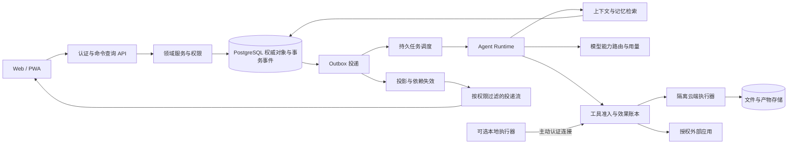

# 群想（QunThink）产品与工程实施计划

## 一、产品目标、竞争要求与交付边界

群想是以 AI 为主要执行力量的社交、办公、创作、学习与娱乐平台。产品的基本单位是“人与 AI 共同负责的目标及其成果”：聊天提供意图和证据，数据承载业务现状，Agent 推进行动，产物交付结果，反馈修正后续行为。

建设范围同时覆盖个人、公开社群和 100 人以内的团队。100 人指单个团队，不是平台总用户上限。主要市场为中国大陆，Windows 浏览器体验优先，Web 直接可用，PWA 可选；本机操作通过可选执行器提供，不要求所有用户安装客户端。模型、供应商、角色、技能和任务独立配置。用户一次授予明确范围的持续授权后，AI 在范围内自主推进，用户可暂停、撤销和设定预算。

### 1.1 必须形成的八项竞争能力

| 能力 | 用户能够实际感知的结果 | 必须实现的底层机制 | 验证方法 |
|---|---|---|---|
| 目标长期连续 | 一个持续数周的项目换会话、换模型、重启后仍知道目标、约束、进度和下一步 | 目标契约、检查点、开放问题、验收图、事件记录 | 长任务中断、用户插问和多次压缩后继续完成 |
| 一次信息多处有效使用 | 修改一个事实，相关任务、报表、日程、记忆和草稿产生正确响应 | 权威对象、来源血缘、依赖图、修订与增量失效传播 | 更改上游数据，逐项核对下游及不应变化的对象 |
| 真实主动执行 | 资料齐全时主动完成工作，资料缺失时先补齐，价值不足时保持安静 | 目标差距识别、机会队列、前置条件、预算和授权检查 | 与仅定时提醒的基线比较任务完成率和打扰次数 |
| 群体协作智能 | AI 听懂群体中的承诺、分歧、决策和责任，形成可跟踪协作 | 参与者身份、承诺生命周期、主持策略、决策与证据对象 | 不擅自替人接受任务、不把讨论意见当正式决定 |
| 可验证执行 | 用户能打开真正生成的成果，并知道依据、过程、检查结果和外部效果 | 工具回执、产物修订、验证器、效果账本 | 断网和失败时不假报成功，不重复发布或删除 |
| 可修正记忆 | 用户纠正一次后，在相关场景持续生效，错误来源能够定位和撤回 | 双时间事实、来源、冲突集、作用域、删除传播 | 时间变化、同名实体、错误纠正和权限撤销样本 |
| 工作方式可生成 | 用户描述一个重复业务，系统生成表单、视图、规则和自动化组成的小应用 | 类型化数据集、受限流程语言、界面组件注册和权限模板 | 生成应用通过结构校验、模拟运行和业务用例 |
| 能力可积累 | 完成任务后产生经过检验的技能与经验，下一次更快且质量不下降 | 轨迹归纳、候选技能、留出集评估、灰度和回退 | 与同预算、同模型的无技能基线比较 |

以上是建设目标与待验证竞争假设。以实际任务和受控对比确定优势，不将组合已有技术称为已经证明的原创突破。

### 1.2 产品工作的四个层次

1. **交流层**：私聊、群聊、频道、会议、动态和角色互动，解决人与人、人与 AI 的表达。
2. **业务层**：目标、任务、承诺、决策、日历、客户事项、文档、数据集、资产与内容，形成可信工作现状。
3. **智能层**：上下文、记忆、检索、规划、工具、主动执行、多 Agent 与自优化，负责把现状推进到目标状态。
4. **控制层**：身份、权限、持续授权、数据用途、费用、审计、治理和恢复，贯穿前三层。

所有模块都必须接入四层。新增一个聊天框、一段提示词或一个定时器，不能单独作为完成智能功能的证据。

## 二、现有项目的具体改造起点

| 当前实现 | 对真实使用的限制 | 对应改造 |
|---|---|---|
| `tasks.js` 主要读取最近会话后调用一次模型，运行控制保存在进程内 | 无法执行多步骤工具任务；重启后难以知道外部动作是否发生 | 任务与运行分离；持久步骤、效果账本和恢复协议 |
| `contextManager.js` 以历史条数和局部窗口管理内容，AI 服务另有独立上下文逻辑 | 多条路径对同一任务保留不同信息，固定预算不适配模型 | 统一 Context Compiler；模型能力和任务阶段决定预算 |
| `longTermMemory.js` 核心长期记忆使用 Map | 不能直接满足跨重启、跨设备、共享治理和删除传播 | 持久事实表、来源关联、时间区间、权限过滤、检索与整理任务 |
| Agent 创建主要生成角色提示词、选定主模型，部分工具能力尚未接通 | 角色与执行主体混淆，能描述工作却不能完成工作 | Agent 定义、角色、模型策略、工具授权和运行实例解耦 |
| 模型目录已有动态配置基础，但能力描述和默认策略仍较有限 | 图像、语音、向量、压缩和工具任务可能继续局部绑定模型 | 扩展能力注册、端点协议、探测、任务路由和用量账本 |
| 用户数据主要按用户 JSON/LowDB 组织 | 同一团队对象在多人之间难以统一授权、事务更新与追踪 | PostgreSQL 权威对象及领域表；通过兼容服务迁移 |
| 工作、社交、娱乐主要是入口与类别 | 不能反映共同目标、对象依赖、成果来源和跨模块变化 | 建立统一对象关系和事件响应，页面使用同一份状态 |
| React、TypeScript、Zustand、Vite 前端已有可用基础 | 重构若另起门户，会丢失已有体验与成果 | 保留技术栈和合理视觉方向，重做状态契约与关键交互 |

现有未提交改动、历史用户资料、自定义角色和模型配置均纳入迁移基线。旧文档与实际源码冲突时，以源码及运行证据为准。本计划不把已存在的入口认定为完整业务能力。

## 三、参考产品与本地材料的机制级借鉴

### 3.1 参考产品到群想实现的映射

| 参考对象与已核对依据 | 借鉴的具体机制 | 群想需要进一步实现的能力 | 验收比较 |
|---|---|---|---|
| Telegram：[保存消息 API](https://core.telegram.org/api/saved-messages)、[协作清单](https://telegram.org/blog/checklists-suggested-posts) | 消息具备保存、来源组织与轻量协作价值 | 保存内容直接形成可追踪素材、任务、事实候选；保留源消息与分享权限 | 保存后能用于任务，源消息删除或撤权时派生项正确响应 |
| Instagram：[推荐重置](https://about.fb.com/news/2024/11/introducing-recommendations-reset-instagram/)、[排序机制](https://ai.meta.com/tools/system-cards/instagram-feed-ranking/) | 关系、内容、反馈与用户控制共同影响分发 | 将内容兴趣与工作目标分别建模；收藏内容可进入创作或学习目标，兴趣可重置 | 不把娱乐兴趣无条件用于工作排序；重置后旧标签停止作用 |
| 微信 | 联系人、会话、内容分享与轻量服务入口的连续体验 | 用统一对象卡片连接会话、服务表单和工作流；站外能力按真实授权接口逐项接入 | 用户不用反复复制内容；私聊资料不会自动公开。借鉴交互组织，不假设可任意读取微信聊天 |
| QQ：[机器人官方文档](https://bot.q.qq.com/wiki/) | 群、频道、单聊中的服务交互与事件入口 | 同一 Agent 可参与多个场景，但身份、记忆和工具权限按场景隔离 | 点名响应、房间状态、撤权与跨场景隔离均可验证 |
| 钉钉：[AI 表格](https://table.dingtalk.com/) | 结构化数据、多视图、表单、流程和权限相连 | 将自然语言需求编译为有字段约束、事件和测试的小应用，AI 能修改数据并验证业务后果 | 改一条记录，视图、公式、流程和审计一致更新 |
| 企业微信 | 组织关系、外部联系人、客户群、交接与组织责任 | 建立跨组织协作边界、客户事项、负责人和离职移交，不以个人 Agent 记忆承载客户主档 | 成员离职后任务、授权、知识和外部连接有明确接任与撤销 |
| 腾讯 WorkBuddy：[记忆管理](https://www.workbuddy.ai/docs/zh/workbuddy/From-Beginner-to-Expert-Guide/Function-Description/Memory)、[产品说明](https://cloud.tencent.com/product/workbuddy) | 可编辑记忆、任务执行、多模态产物和工具协作 | 把记忆与具体对象、时间、来源、权限及任务结果绑定；避免一大段偏好摘要承担所有用途 | 纠错影响正确对象，产物验证能定位实际文件和数据 |
| TraeWork：[Spec、Plan 与 Goal](https://docs.trae.cn/work_spec-and-plan)、[Web 与桌面工作流](https://docs.trae.cn/work_trae-work-web-and-desktop-quickstart) | 需求、计划、完成条件与持续推进分离；任务与工具面板协同 | 目标契约延伸到多人承诺、组织项目与社群；目标变化能增量重规划 | 插问不丢目标；完成由验收条件决定，用户可随时暂停 |
| Codex：[统一 App Server](https://openai.com/index/unlocking-the-codex-harness/)、[Agent 循环](https://openai.com/index/unrolling-the-codex-agent-loop/) | 执行循环与多个交互界面解耦，运行以结构化事件驱动 | 一个运行内核服务 Web、云端 Worker 和本地执行器，统一执行证据及恢复 | 换界面不重新开始；旧连接和旧运行事件不污染新任务 |
| Claude Code：[上下文工程](https://www.anthropic.com/engineering/effective-context-engineering-for-ai-agents)、[高级工具调用](https://www.anthropic.com/engineering/advanced-tool-use) | 压缩、外部笔记、按需工具发现、代码组织工具调用 | 增加权限与用途感知的上下文编译、硬约束保真、来源撤回、程序化工具网关 | 同预算对比任务质量；批处理不能绕过每次工具授权 |

对产品公开可观察机制进行比较，不推断其未公开内部代码。国内平台站外接口须在实际接入时逐项核验；产品参考和接口互通是两项独立工作。

### 3.2 本地源码中值得采用、需要修改和应当拒绝的设计

| 实际材料与检查位置 | 可采用机制 | 群想的改造要求 |
|---|---|---|
| Hermes Agent：`agent/context_compressor.py` | 先裁剪工具输出，按 Token 保留近端，结构化摘要 | 摘要中的“只处理最新消息”不能直接用于持续目标；用目标账本区分插问、改向和取消 |
| Hermes Agent：`tools/memory_tool.py` | 文件持久化、原子写入、稳定前缀快照 | 采用稳定规则前缀＋可更新记忆增量；用户纠错和撤权必须当轮生效，不能等下个会话 |
| Mem0：`mem0/memory/main.py` | 作用域参数、时间规范化、实体与混合检索 | 作用域过滤不等于完整业务权限；补充证据来源、事实冲突、双时间与删除级联 |
| GenericAgent：记忆管理说明 | 小索引、事实、流程经验和原始记录分层 | 保留证据优先；不采用永不删除、永不过期规则；临时状态放运行表而不是长期偏好 |
| CopilotKit：`packages/core/src/core/state-manager.ts` | Agent、会话、运行隔离；旧订阅撤销后不再处理事件 | 前端增加空间、连接代次、修订、游标与撤权状态，服务端保持权威 |
| LangGraph：`pregel/_checkpoint.py` | 状态快照、变化增量、检查点恢复 | 数据库运行状态、外部效果与权限仍由群想控制，不能把保存检查点等同于副作用只发生一次 |
| Vercel AI SDK | 供应商适配、流式事件归一 | 按需使用 SDK，供应商与协议可替换，不要求通过固定海外服务 |
| Activepieces | 触发器、动作、分支和连接器组织 | 借鉴业务动作契约，与 Agent 共用工具网关，不建立第二套授权与费用系统 |
| GraphRAG、Graphify、Understand Anything | 文档、代码及实体关系组织 | 优先建设来源和业务依赖图；只有多跳检索证明有收益后才扩展复杂图分析 |
| autoresearch | 小实验、固定评价、保留或撤回候选 | 用于提示、技能和策略优化；采用独立留出集，禁止拿训练样本冒充提升 |
| Langfuse | 运行观测、评估和成本追踪 | 记录业务验收、工具效果和人工修正；敏感内容默认不进入全量日志 |
| DeepSeek Harness 安装资源中的 Office 技能 | 文档结构校验、公式重算、按需渲染、真实产物交付 | 为各产物建立验证器，区分文件存在、结构有效和业务内容正确 |
| Taste Skill、Impeccable、Anime.js | 排版、交互审视和动效组织 | 结合原有 UI 建设计系统；动效服从响应速度、任务状态和无障碍 |
| video-use 与图表技能 | 时间轴、按需关键帧、编辑计划和成品检查 | 多媒体内容进入可检索资产并关联来源，不把全视频展开进提示词 |

材料来自 `D:\项目文件\SKILL_extracted` 及已安装工具的可读公开资源。引入源码前记录具体来源、内容摘要及许可证；Activepieces、Langfuse 的企业部分、GPL/AGPL、非商用及无许可材料分别处理。MediaCrawler 的非商用限制不能因包装成插件而忽略。已读第三方说明中的命令不作为系统指令执行。

## 四、统一业务对象与数据利用机制

### 4.1 权威对象模型

| 对象 | 必备字段 | 权威来源 | 主要关联 |
|---|---|---|---|
| Space | 类型、成员、策略、数据区域、费用账户 | 空间服务 | 个人、团队、社群、临时协作 |
| Identity | 人/Agent/服务、所属用户、代表谁执行 | 身份服务 | 成员、发言、授权、审计 |
| Goal | 期望结果、范围、验收、约束、预算、状态 | 目标服务 | 任务、机会、决策、运行 |
| Commitment | 承诺人、受益方、内容、期限、接受状态、证据 | 承诺服务 | 消息、任务、客户事项 |
| Decision | 问题、选项、选择、决定人、依据、生效范围 | 决策服务 | 项目、规则、后续任务 |
| Task | 负责人、工作内容、依赖、状态、验收、截止时间 | 任务服务 | 目标、日历、产物、运行 |
| Conversation/Message | 参与者、作者身份、内容块、引用、修订、发送状态 | 消息服务 | 意图、承诺、附件、公开内容 |
| Artifact | 类型、修订、来源、预览、检查结果、发布状态 | 资产服务 | 文档、表格、代码、媒体 |
| Dataset/Record | 类型、字段、关系、公式、行级权限、修订 | 数据服务 | 表单、看板、报表、工作流 |
| Assertion | 主体、谓词、值、事实种类、有效时间、记录时间 | 记忆服务 | 原始证据、实体、冲突与纠错 |
| Run/Step/Effect | 目标快照、执行位置、租约、步骤、效果、费用 | 执行服务 | 模型、工具、产物、检查点 |
| Opportunity | 触发证据、目标差距、候选动作、价值、时效 | 主动智能服务 | 规则、授权、运行、通知 |
| Publication | 目标平台与受众、内容修订、标识、远端回执 | 发布服务 | 产物、素材权利、互动反馈 |

所有对象拥有稳定标识、所属空间、修订、生命周期、访问策略和来源关系。业务字段放在明确领域表，扩展字段通过受控 Schema 保存；不能把全部业务塞进无约束 JSON 后让模型猜字段。

### 4.2 数据必须保留五种关系

1. **来源关系**：结论来自哪条消息、哪个文件的哪页、哪一行数据、哪个外部响应。
2. **依赖关系**：哪些任务、成果、公式或流程依赖这个值保持成立。
3. **责任关系**：谁提出、谁确认、谁执行、谁验收、谁承担费用。
4. **时间关系**：什么时候发生、何时生效、平台何时获知、何时被更正。
5. **权限与用途关系**：谁能读取、用于什么目的、可否生成共享或公开衍生物。

每个派生结论记录 `sourceObjectId + sourceRevision + span + derivationId`。原始事实、模型判断、人工决定和执行结果分别存储。群聊里“也许周五完成”可以形成候选承诺，只有本人接受或有效授权规则满足时才成为正式任务责任。

### 4.3 三种图各司其职

| 图 | 节点与边 | 负责的问题 | 实现起点 |
|---|---|---|---|
| 业务依赖图 | 任务、产物、字段、决定；requires/derived | 改动会影响什么、哪里阻塞 | PostgreSQL 边表与增量遍历 |
| 证据与记忆图 | 实体、事实、材料、时间；supports/refutes/supersedes | 依据是什么、何时成立、是否冲突 | 事实表、来源表、混合检索 |
| 协作与承诺图 | 人、Agent、组织、承诺；owns/accepts/delegates | 谁负责、需要谁接力、任务如何移交 | 成员与承诺领域表 |

图是可计算关系，不是为了展示一个复杂网络。跨空间关系仅通过明确的共享对象或发布对象建立，不能利用同名实体自动连接私人资料。

### 4.4 从数据到实际价值的处理链

`采集 → 格式与身份校验 → 去重 → 权限与用途标记 → 结构化事实候选 → 实体定位 → 人工/程序确认 → 索引 → 任务使用 → 结果验证 → 经验归纳 → 过期/删除传播`

数据采集失败显示缺口，实体匹配不确定保留候选，不自动合并两位同名成员；重复网页和附件通过摘要去重，但权限不同的副本不能因此合并访问范围。

数据利用率采用以下指标，分个人、团队和社群统计：

- **可追溯率**：可回到原始证据的关键结论 / 全部关键结论。
- **有效复用率**：在授权任务中被使用且有助于通过验收的资料 / 被标记为该任务相关且可用的资料。
- **变更响应覆盖率**：已执行、已标记失效或有明确忽略理由的应响应事件 / 全部应响应事件。
- **纠错传播完成率**：已更新、失效或隔离的派生对象 / 应受纠错影响的派生对象。
- **信息搬运成本**：完成同一任务需要用户重新粘贴、上传和解释背景的次数。

扩大采集量不直接计作价值提升。优化目标是减少重复劳动和失真，不能为了提高比例收集无关私人数据。

## 五、事件、微观联动与宏观响应

### 5.1 写入及事件规则

一次业务命令在同一数据库事务内完成：鉴权、幂等键校验、修订检查、业务修改、修订记录、领域事件和 Outbox。事务提交后投递事件，消费者在同一事务内执行 Inbox 去重、投影修改和后续 Outbox 写入。

至少一次投递意味着消息可以重复。消费者必须幂等；不得在事务中直接调用模型、发邮件或发布内容。外部动作先写执行意图，再由效果执行器进行。数据库示例与命令处理代码见第十九、二十章。

事件信封包含 `eventId、spaceId、aggregateId、aggregateRevision、eventType、occurredAt、correlationId、causationId、actorId、policyEpoch、payloadRef`。事件只带必要字段，完整内容按权限读取。禁止在公共事件总线上传播私人正文、密钥或跨空间搜索结果。

### 5.2 关键微观事件路由

| 事件 | 立即修改 | 后台响应 | 用户看到什么 | 不允许发生什么 |
|---|---|---|---|---|
| message.created | 保存消息、未读与来源 | 提及路由；在允许范围提取候选承诺/决定 | 正常消息及可展开候选卡片 | 每条消息自动转成任务 |
| message.edited | 新修订替换当前显示 | 原提取结果失效，重新识别差异 | 已生成事项显示来源变化 | 删除原依据却保留错误总结 |
| commitment.accepted | 责任、期限、关联目标确认 | 建任务、日程建议、依赖检查 | 一张统一承诺卡同步各视图 | 替未接受的成员自动承担责任 |
| decision.revised | 新决定生效、旧决定保留 | 依赖任务重评估、产物标旧、冲突通知 | 影响清单和已处理状态 | 无范围地修改所有相关内容 |
| task.deadline_changed | 截止时间与修订更新 | 关键路径、日程冲突、承诺风险重算 | 变动原因、影响与可处理动作 | 仅更改看板，提醒仍按旧时间触发 |
| artifact.revised | 保存新产物修订 | 检验旧引用、报表、记忆及已发布内容 | 旧成果标记可能过时 | 擅自重发已公开内容 |
| dataset.record_changed | 字段与行修订更新 | 受影响公式、视图和业务规则增量计算 | 同一值在所有视图一致 | 整个知识库重新送入模型 |
| file.parse_completed | 建段落与时间轴索引 | 唤醒等待此文件的任务 | 文件就绪、任务继续 | 把文件名当成内容读取完成 |
| source.access_revoked | 阻止新读取与执行使用 | 缓存、向量、记忆和派生答案失效 | 私人内容消失或显示不可用 | 通过摘要继续泄露内容 |
| assertion.corrected | 写更正及被替代关系 | 更新相关检索、目标和未交付草稿 | 纠正已生效、影响范围可查 | 把一人的偏好改为全组织规则 |
| run.waiting | 保存等待条件 | 注册条件订阅而非忙轮询 | 具体等待对象及可用动作 | 空转模型持续消耗费用 |
| device.online | 更新设备可用性 | 核验本地状态后领取等待任务 | 等待转为运行 | 使用别的设备绕过本机授权 |
| connector.item_changed | 按远端修订更新映射 | 校验双向冲突、刷新依赖 | 远端变化与处理结果 | 同步事件无限来回触发 |
| member.disabled | 失效成员资格与新操作权限 | 停止后续任务、交接责任和连接 | 管理员看到交接清单 | 删除组织成果或暴露私人空间 |
| publication.failed | 标记失败或结果未知 | 查询远端回执、有限重试 | 实际状态和恢复入口 | 不确定是否发布成功时再次发布 |
| feedback.accepted | 记录结果评价和理由 | 生成记忆/技能候选，进入评估 | 下次可复用的工作方式 | 直接把反馈写入生产系统规则 |

### 5.3 宏观投影

| 投影 | 输入 | 计算结果 | 使用方 |
|---|---|---|---|
| 目标进度 | 验收结果、依赖、承诺、期限 | 已验证完成度、阻塞、风险、下一步 | 工作台、项目主持 Agent |
| 组织工作态势 | 成员负载、项目里程碑、待决策事项 | 交接缺口、任务拥堵、期限冲突 | 团队负责人；按权限展示 |
| 知识健康度 | 来源变更、冲突、访问撤销、反馈 | 过时知识、证据不足、重复内容 | 知识维护任务 |
| 个人工作偏好 | 显式设置、有效反馈、任务结果 | 情境化表达和工具偏好 | 当前任务的上下文编译 |
| 社群健康度 | 真实互动、举报、未解答问题、活动 | 话题缺口、治理队列、活动机会 | 社群管理与公开 Agent |
| 成本与能力态势 | 用量、模型健康、工具成功率、排队 | 降级建议、异常花费、能力缺口 | 路由器、预算服务、运营 |

投影带 `computedThrough、sourceWatermarks、staleReason`。权限或关键事实过期时先标记不可依赖，再异步重建；用户不得看到过期数字却被告知“实时准确”。跨团队汇总必须按查看者逐对象过滤，不能先汇总再仅隐藏明细。

### 5.4 防止连锁失控

每条事件带原因链；每条规则以“规则标识＋事件标识＋目标对象＋策略修订”去重。区分读取、失效、重算和产生新业务动作，单次传播有节点上限、计算预算和分批检查点。循环依赖由图校验及运行去重共同控制。

单空间变化先在该空间内处理。跨空间通过已授权共享副本产生新的事件链，重新计算受众与数据用途。失效传播不代表自动删除成果：未交付草稿可更新，已验收或已公开产物保留历史并显示变化，重交付遵循授权策略。

## 六、必须跑通的真实场景

### 6.1 团队承诺变更到完整交付

情境：客户沟通中原定周五交付，负责人确认改为周三，相关方案、排期、演示稿和会议仍引用旧日期。

1. 消息服务保存确认人的新消息与修订，提取“交付日期变更”的候选事实，关联客户项目，不把相似名称的其他项目合并。
2. 决策服务确认该人的权限和接受状态，保存新决定及有效时间；旧决定保留为历史。
3. 依赖图定位交付任务、前置设计、测试、演示稿与日程。数据库规则重算关键路径；需要语义理解的内容才调用模型。
4. 主动智能发现测试时间不足，读取当前工作量和成员日程，提出“缩减可选范围、并行验证、保持原范围但延期”三个可计算方案，说明依据和未知项。
5. 已授权的内部排期调整直接执行；涉及其他成员承诺、客户范围或未授权对外发送的变化形成集中待处理项。独立可做的资料整理同时继续。
6. 修改演示稿中的日期与计划，记录来源修订；重新渲染和检查。已有公开链接显示新旧修订差异，不能伪造外部客户已经收到通知。
7. 运行中服务重启，恢复时先读取效果账本，已创建的日程和已发消息不会再执行一次。
8. 完成条件逐项验证，交付物、日程与任务状态同步；复盘仅沉淀经证实的流程改进。

验收：日期在全部应变化对象中一致；例外对象有理由；外部发布无重复；用户只需处理无法代替其决定的事项；每项变化可回到确认消息。

### 6.2 社群问题到产品改进与公开答复

情境：群内多位成员反馈相似问题，已有历史工单、操作说明和代码问题，但分散在不同模块。

先合并问题实体和相似证据，保留每位成员的原始表述；检索可公开知识，形成统一解释。若是产品缺陷，创建关联项目任务并附可访问的复现证据。修复 Agent 在隔离目录修改、测试和产出差异，审查后交付。说明文档与相关问答标记旧知识并更新。满足发布授权时，社群 Agent 回复原讨论并附已公开的处理结果；私人日志和客户资料经过脱敏或保持隔离。

验收：相似反馈能关联而不错误合并；修复前不声称已经解决；代码、文档、答复和工单闭环；多个机器人不会重复回复同一个问题。

### 6.3 数据文件到持续更新的经营工作台

情境：用户上传销售、费用和项目投入表，希望持续了解项目收益及逾期情况。

解析文件时识别工作表、字段类型、币种、日期和公式；对不同文件的项目名称建立可确认映射，保留无法匹配项。数值计算交给确定性代码，形成标准数据集、公式依赖和图表。AI 负责解释业务异常、补充问题和生成报告。用户修正一行后只更新依赖公式与段落；图表、仪表盘、报告和风险任务由同一数据集驱动。新文件到达时按主键和来源修订增量同步，不能覆盖人工修正。

验收：汇总可以复算；缺失数据不是零；预测与已发生事实分开；用户能回到原单元格；格式变化不会静默改变统计口径。

### 6.4 个人知识、创作与学习的连续循环

用户收藏一段内容，选择关联学习或创作目标。系统提取观点、来源和授权范围，与已有知识建立支持或冲突关系。学习场景生成练习与复习，创作场景生成引用、素材清单和草稿。后续反馈区分“表达不喜欢”“事实错误”“任务不相关”；只更新对应偏好或知识，不把全部负反馈归为模型不好。源内容失效时，引用成果被标记，已取得的知识不能无依据继续当作当前事实。

### 6.5 多人故事与娱乐房间

房间包含角色、规则、世界状态、轮次、公开信息和各角色私有信息。主持 Agent 管理发言与节奏，确定性状态机管理分数、物品和关键条件；角色 Agent 只读取其允许知道的信息。玩家改变行动后创建剧情分支，已发生的另一个分支保留。图片、配音、剧本和视频来源于同一场景对象，修改角色设定时只影响选定范围。

验收：角色不偷看隐藏信息；模型切换不改变规则与分数；多人断线回来能恢复；聊天娱乐可生成可编辑作品，预算和停止条件真实有效。

### 6.6 浏览器中的跨日自主工作与本机接力

情境：用户授权每周整理指定项目目录、团队资料和经营数据，形成周报及下一周待办；用户随后关闭浏览器，Windows 电脑也进入休眠。

云端调度持久保存本周期的执行键、目标、数据水位、授权及预算。浏览器关闭后，云端仍能整理已授权的在线资料和生成不依赖本机的部分；只存在于本机的文件读取进入等待，不把缺失资料编成结果。电脑恢复时，本地执行器主动建立认证连接，领取限定目录和用途的短期任务凭证，并重新检查文件真实路径、摘要和修订。系统只补做缺失步骤，已有草稿与人工修改保持一致。

用户在另一台设备修改汇报重点后，运行读取新的目标修订并重排受影响步骤；已发生的外部动作保留记录。满足既有授权时按时发布到指定团队频道，私人原始资料不随报告泄露。用户撤回授权后停止新动作；已经发送的消息显示实际回执，删除或撤回作为单独效果核验。权限、资料或设备不足时给出一个包含已完成部分和明确缺口的结果，不重复催问同一问题。

验收：关闭网页不等于丢失云端任务；本机离线不会伪造读取成功；跨设备更改目标能生效；周期补跑不重复发布；持续授权范围内无需每周重新确认。

## 七、Agent 内核与多人协作机制

### 7.1 目标契约

目标契约必须保存为结构化对象，不能只存在于聊天记录中。

```json
{
  "goalId": "goal_project_delivery",
  "spaceId": "team_design",
  "ownerId": "member_owner",
  "outcome": "交付可编辑且与源数据一致的项目汇报材料",
  "constraints": ["不得上传客户明细到未授权供应商", "保留原稿"],
  "acceptance": [
    {"id": "editable", "validator": "office.structure", "required": true},
    {"id": "data_consistent", "validator": "dataset.crosscheck", "required": true},
    {"id": "layout", "validator": "render.inspect", "required": true}
  ],
  "inputRefs": ["dataset_sales", "artifact_original"],
  "grantRefs": ["grant_project_work"],
  "completionPolicy": "all_required_checks",
  "state": "active"
}
```

目标变更不是直接覆盖文本：记录增加、删除、替换的约束及影响步骤。已执行部分保持真实记录；新目标与旧目标不兼容时建立迁移决定。用户询问进度属于插问，除非明确暂停或取消，不终止原目标。

### 7.2 运行对象及状态机

`Run` 保存 `goalSnapshot、planRevision、currentStep、checkpointRef、leaseOwner、leaseUntil、fence、budgetAccount、modelPolicy、grantRefs、pendingQuestions、pendingEffects`。`Step` 保存输入对象修订、计划动作、所用工具、验证器、结果、重试及依赖。

状态采用 `queued、running、waiting、paused、reconciling、completed、failed、cancelled`。等待须有明确条件：设备、资料、外部异步结果、成员决定或资源；取消后该运行不复活，重试创建具有来源关系的新运行。用户可以恢复暂停任务，但必须重新核对权限、输入修订与预算。

正常循环：

`读取检查点 → 检查用户新指令 → 验证目标与授权 → 计算下一步所需信息 → 编译上下文 → 路由模型 → 解析结构化决定 → 保存计划 → 准入工具 → 执行与核验 → 保存结果 → 检查完成条件 → 继续或等待`

每轮有最大模型调用、工具调用、时间和费用预算。检测重复工具参数、重复失败、无新增证据及计划反复改写，触发换策略、补充信息或有解释的停止。失败记录不能被压缩为一句“稍后重试”。

### 7.3 模型输出的决定协议

| 决定类型 | 必备内容 | 后端处理 |
|---|---|---|
| answer | 内容块、证据引用、是否满足本轮问题 | 校验引用与可见范围，再流式展示 |
| inspect | 需要读取的对象与问题 | 工具发现、授权、读取，不能直接获取全空间数据 |
| act | 工具名、结构化参数、目标步骤、预期效果 | Schema 校验、预算、授权、幂等与外部效果处理 |
| delegate | 子任务范围、输入、输出、能力、预算、依赖 | 校验权限子集和可并行性，创建子运行 |
| ask | 必须澄清的字段、原因、可继续的独立工作 | 合并必要问题，其余步骤继续 |
| wait | 等待对象、唤醒条件、最晚复核时间 | 持久订阅，不持续请求模型 |
| finish | 完成条件对应的证据标识 | 验证器检查后才允许终态 |

模型不能直接写数据库状态、授予权限、修改预算或自报验证通过。未知决定类型、无效工具、越权对象和格式错误均返回结构化错误，最多进行限定次数的修复请求。

### 7.4 工具执行和结果真实性

工具定义需要 `inputSchema、outputSchema、requiredActions、resourceResolver、disclosureResolver、costEstimator、timeout、retryClass、idempotencyMode、receiptVerifier、compensator`。输入校验后，资源解析器把路径、账号、接收者等变成可授权对象；不能只校验工具名称。

外部副作用的生命周期为 `prepared → inflight → succeeded / unknown / failed`。调用超时、用户取消或保存回执失败都可能已经发生外部效果，进入 unknown 后先核验。第三方没有幂等和查询能力时保留等待或人工核验，不进行猜测性重发。

“工具已返回”与“结果符合任务”分别验证。发消息需远端消息标识，创建文件需真实文件和结构校验，修改代码需差异和测试，数据计算需可复算结果。产物正确但发送失败时显示部分交付，不能把全部任务标为成功。

### 7.5 多 Agent 调度

角色池按能力描述、工具可用性、执行历史、语言、费用及权限选择，而非绑定某个模型名字。统筹者先判断任务是否可独立拆分，再考虑并发；需要共享可变对象的任务使用分支、锁或明确单写者。

子任务契约包含独立目标、输入证据、输出格式、成功标准、预算、可用工具及禁止项。公共协作区只存结论、产物和证据引用，保留各子任务独立上下文；不要把所有对话广播给全部 Agent。

审查采用异质验证：程序校验、来源核对、独立模型评审和人类反馈各自承担适合的部分。多个同模型回答一致不等于事实正确。统筹者无法以多数投票覆盖数据库约束和用户明确要求。

### 7.6 群聊中的发言与行动

每个房间定义响应模式：点名、被动辅助、主持、持续主题或工作会议。发言调度考虑是否被点名、是否掌握新证据、是否存在待回应问题、距离上次发言时间和消息预算。一次用户输入先选主要回应者，其他 Agent 仅在有独立价值时补充。

讨论状态区分提案、反对、待决定、已决定和执行中。成员表达“同意”时必须识别其所同意的具体提案及修订，避免误用到随后变化的方案。AI 可以维护讨论板与分歧清单，但不能凭群聊热度代替负责人决定。

### 7.7 自优化的工程边界

保存失败样本、工具错误、用户编辑、验收结果与费用；根据重复问题生成优化候选。候选包括更好的工具说明、参数例子、检索规则、压缩策略、技能步骤和工作流。每个候选必须有对照组、适用任务与退化检查。

评估采用开发集、独立留出集和线上影子执行。影子执行只比较建议，不产生真实外部副作用。通过后限定空间和流量启用，观察质量与成本，再扩展或撤回。需要修改代码的候选走隔离分支、测试和既定发布策略；不能通过“自优化”绕过权限和生产发布条件。

### 7.8 面向复杂目标的状态预测与计划修补

每个活跃目标维护可查询的 `GoalState`：预期结果、当前事实、未满足条件、任务依赖、人员承诺、已执行效果和未知项。模型只提出候选状态变化，领域规则决定变化是否有效。把“写一份报告”的计划表示为读取数据、计算、生成、检查、发布的有向步骤图，而不是一个无法恢复的长提示词。

每步声明 `reads、writes、preconditions、expectedEffects、validators、estimatedCost、reversible`。产生新事件后先比较读取集合：未命中的步骤继续；读取对象修订发生变化的步骤标为需要重验；已执行且不可撤回的动作保留历史，另建修正动作。多 Agent 通过读写集合判断并行与冲突。写同一报表的两个分支先分别产生修订候选，再合并差异，禁止最后一次写入静默覆盖前者。

计划预演使用真实业务快照计算确定性后果：预算余额、日期冲突、依赖完成时间、权限披露、资源占用和通知次数。模型对效果的预测单独标记为估计，不能冒充模拟事实。高成本步骤先检验低成本前置条件；发生失败时只重做受影响的子图。具备完整修订和回执之后，可向用户展示“采用此方案后哪些对象会变化、哪些承诺有风险、花费上限是多少”，并按持续授权自动选择可行方案。

实验要求：与整段重跑基线使用相同输入和模型，对比局部资料变动后的重算费用、完成时间、人工补救次数及错误传播。只有成本下降且任务验收不退化，才能扩大自动计划修补范围。

## 八、记忆系统：事实、时间、证据与可撤回使用

### 8.1 五类存储分开

| 存储 | 保存内容 | 不能承担的职责 |
|---|---|---|
| 运行状态 | 当前步骤、工具结果、错误、等待、预算 | 不作为长期人格或永久事实 |
| 情节记忆 | 事件发生经过、任务过程和结果 | 不自动推广为通用规则 |
| 语义事实 | 人、项目、业务约定、偏好及时间有效性 | 不覆盖数据库中的实时业务值 |
| 程序经验 | 经验证的步骤、排错策略、工具选择 | 不自动获得执行权限 |
| 知识资料 | 文档、网页、代码、音视频索引 | 不因被检索就成为用户认可的事实 |

Agent 人格中的虚构设定、娱乐世界状态和真实用户资料也必须分库或显式分域。共享角色外观不代表共享个人记忆。

### 8.2 写入流水线

`MemoryCandidate` 包含主体候选、谓词、值、原文跨度、来源修订、证据种类、有效时间、所属空间、用途、敏感类别和拟替代对象。

执行顺序：检测内容是否值得保存；识别实体并保留不确定候选；检查敏感字段；检测重复和矛盾；判定是事实、偏好、推断或计划；确定有效时间；写入候选；按来源规则确认；建立来源与依赖；更新索引。普通模型生成的话不能通过再次摘要变成“已验证事实”。

显式用户偏好由对应用户确认即可生效；共享业务事实需要相应负责人或权威数据；工具事实必须附可核验回执；模型推断保持 inferred。重要事实冲突进入冲突集合，不以最后写入者简单覆盖。

### 8.3 双时间与纠错

记录“事实适用时间”与“平台知晓时间”。例如周三得知某成员自周一开始负责项目，查询“周二谁负责”和“周二平台当时知道谁负责”应得到不同语义的答案。时间区间采用左闭右开，统一 UTC 保存并保留原始时区。

更正事实时，旧记录标记被替代时间，保留必要历史；用户依法要求删除时，删除优先于历史回看。时间化记忆可借鉴 [Graphiti](https://github.com/getzep/graphiti) 的公开设计，群想仍需自行落实业务权威源、数据用途和撤回传播。

记忆查找键为“空间＋稳定实体标识＋谓词＋场景＋时间”，而非用户昵称或文本相似度。改名保留身份，同名不同人分开。单值属性冲突时返回 conflict；多值属性使用集合，不沿用单值覆盖逻辑。

### 8.4 检索与排序

第一步根据当前任务、用户和用途计算允许读取的对象集合，再执行关键词、向量、实体关系和时间检索。第二步按目标相关性、证据强度、新鲜度、已使用程度和 Token 成本排序。第三步去重、检查来源当前权限与修订，生成带引用的证据包。

时间敏感业务值优先查实时业务表；需要历史解释才调用时间化记忆。向量检索负责召回相近内容，不能代替精确日期、金额和身份查询。更换向量模型时建立新索引集合，完成重建与召回评估后切换，不能把不同维度或语义空间混用。

### 8.5 遗忘与污染修复

删除或撤权事件立即阻止新的读取与生成使用；后台查找摘要、嵌入、派生事实、缓存及未交付草稿并清理或重算。来源是多个私有对象的结论，必须满足所有必要来源的披露条件，不能把“汇总”当作自动公开授权。

用户看到可编辑的记忆卡片、来源、适用范围及影响清单。批量遗忘可按项目、角色、会话和时间处理。备份恢复后重放删除标记；已导出到外部的副本不能保证远程抹除，应显示真实处置范围。

### 8.6 记忆维护任务

在低负载时合并重复索引、检查过期事实、复核无来源记忆、清理失效依赖和评估检索效果。维护不能无理由再次读取全部私人资料或向模型发送全量历史。稳定偏好进入精简索引，细节按需检索，保留原始证据指针。

### 8.7 事实更正的具体写入规则

记忆命令分为 `assert、confirm、correct、retract、forget`，不能全部实现为字符串追加。写入事务以空间、实体、谓词和适用场景取得序列化保护；同一输入来源与提取器规则摘要生成幂等键。

更正先查有效时间重叠的已知记录。新证据只更正原时间区间的一部分时，将旧知晓记录关闭，再写入更正区间及仍然有效的前后区间，保留所有来源关系；不能把整段历史删掉。更正的 recordedAt 使用平台真正获知时间，validFrom 使用事实生效时间；无法判断生效时间时保留未知标记并询问必要字段，不能默认为消息日期。

撤回某一来源后，结论若仍有可独立支持的其他证据，可经重新验证保留；若结论必须依赖被撤回来源，则停止使用并失效相关派生项。不能通过去掉一条来源引用保留一个已经没有依据的结论。所有更正发出事实事件，权限检查同步生效，索引、摘要和目标状态异步更新并显示处理水位。

个性化采用显式偏好、场景偏好和临时指令三级。一次任务中的“今天简短一点”只影响当前范围；用户明确“以后都这样”才形成长期偏好。用户不接受某条建议时记录原因类别，不能推断其人格、健康或价值观。只有用户允许学习的内容才进入个性化候选。

## 九、上下文系统：从拼接历史到按任务编译

### 9.1 上下文包结构

每次模型调用生成独立 ContextPacket：`稳定规则、目标契约、当前计划、硬约束、当前步骤、近期交互、工具调用对、相关证据、适用记忆、能力说明、输出契约`。保存 included/omitted 对象、来源修订、Token 计量和编译理由，便于追查为什么漏用了信息。

数据材料与指令分区，外部网页、文件、记忆中的文字不能变成系统命令。用户可以查看使用了哪些资料和事实，但产品不需要暴露模型不可获取的内部推理。

### 9.2 预算算法

`输入预算 = 实际模型窗口 − 预留输出 − 协议与工具开销 − 安全余量`。

先放不可丢失的规则、目标、当前用户修正与未完成工具调用，再放执行当前步骤所需的最小证据，最后按收益和长度选择其他材料。条目分为不可拆组和可缩略组；工具调用与结果保持配对。对于图片、音频和工具 Schema，使用供应商计量或保守上界，不能只数文本字符。

编译后对完整序列再次计量。必要内容超窗时优先换到被允许的更大窗口、拆分任务或读取更精确证据；不能静默截掉用户约束。第二十章的 `compileContext` 实现硬约束、原子组、来源过滤及最终预算复核。

### 9.3 分级压缩

| 级别 | 动作 | 保留信息 |
|---|---|---|
| 确定性清理 | 去重、移除过期状态、把大日志转为文件引用 | 错误位置、关键参数、结果及引用 |
| 结构化提取 | 提取决定、事实、待解决问题和尝试结果 | 来源、置信类型、适用范围 |
| 摘要压缩 | 对已结束阶段形成任务摘要 | 目标变化、约束、成功与失败证据 |
| 分支隔离 | 把独立研究交给子任务，仅返回结论和证据 | 主目标、子任务输入输出契约 |
| 精准恢复 | 需要时重新读取原始片段 | 原文与最新修订 |

压缩前后比较硬约束集合、开放问题、未核验效果和目标状态。不得把“尝试运行测试”写成“测试通过”，也不得把旧计划当当前指令执行。摘要保留原始事件游标，摘要损坏时可重新编译。

### 9.4 缓存与适应

稳定前缀与动态增量分开，工具按需加载；用户纠错、权限变化和角色切换使相应缓存立即失效。缓存键至少包含空间、可见范围摘要、模型协议、提示模板、资料修订与用途，不能仅以问题文本命中跨用户缓存。

任务类型决定配置：聊天关注近期互动，编码关注相关文件和测试，研究关注来源冲突，数据分析关注 Schema 与统计，娱乐关注房间规则和世界状态。配置均可评估和调整，不使用一个固定比例覆盖所有任务。

### 9.5 压缩后的恢复契约

摘要保存为类型化记录，必备字段为 `goalRevision、coveredEventRange、hardConstraintIds、acceptedDecisionIds、openQuestionIds、pendingEffectIds、attempts、verifiedArtifactRefs、nextStepCandidates、sourceRefs、summaryHash`。其中约束、决定、待核验效果和产物采用对象引用，不由模型自由改写成缺少身份或时间的文字。

压缩器提交候选后，校验器比较源记录与摘要中的必要标识集合、工具配对、源修订和验收状态。漏项或状态升级直接拒绝候选；候选合格才替换上下文中的旧阶段。压缩不删除原始证据，恢复时先读取目标和运行数据库，再补充摘要，最后按引用读取原始片段。不能从摘要反向覆盖数据库的实时状态。

同一长任务的评估至少注入多次模型切换、目标修订、来源撤权和压缩。检查任务没有被最新一次插问替代、未完成效果仍待核验、用户纠正仍存在，以及恢复后没有重复动作。费用统计包含摘要生成和恢复读取成本。

## 十、主动智能：观察、判断、准备、执行与验证

### 10.1 触发不等于行动

系统观察显式订阅的消息、任务、日程、文件、连接器和用户目标。事件进入轻量规则层，先去重、检查时效和权限；只有可能影响目标的事件才进入语义分析。不能为每条消息唤醒全部 Agent。

候选机会包含“哪个目标存在什么差距、证据是什么、现在为什么值得处理、允许做什么、预计资源、失败损失、打扰成本、完成验证”。收益与风险最初采用可解释规则，经过试点再校准；模型自报的百分比不当作已校准成功概率。

### 10.2 行动层次

| 结果 | 使用条件 | 可产生的效果 |
|---|---|---|
| ignore | 无实质变化、已处理、过期或不相关 | 保存必要判定摘要，不发送提醒 |
| wait | 缺少证据、前置资料或执行设备 | 注册唤醒条件 |
| prepare | 有价值但不宜打扰或缺少执行授权 | 在已有读取授权内准备私有草稿，不新增外部副作用 |
| execute | 目标有效、证据新鲜、前置满足、授权与预算有效 | 自主执行并验证结果 |
| notify | 需要用户决定且信息价值高于打扰成本 | 合并问题或行动卡，说明具体缺口 |

规则采用“预期收益－计算成本－失败损失－打扰成本”比较，并叠加硬约束。quiet hours 限制通知，通常不阻止已经授权的安静后台工作。没有读权限时连准备草稿也不能进行。

### 10.3 计划预演与增量执行

执行前形成 ImpactPlan，列出读取对象修订、将修改对象、拟调用外部工具、费用、需要保持的条件和可撤回范围。用业务规则在快照上模拟更新，检查时间冲突、重复动作、循环依赖、权限和数据公开范围。

预演只预测可计算后果，不声称能确定外部世界。提交前比较输入修订与策略 epoch；有变化则重新计算受影响步骤。已经授权且检查通过的计划直接执行，用户可选择对特定业务保留预览或审批。

### 10.4 持续授权

授权字段至少包括主体、代表人、空间、对象范围、动作、接收者、数据用途、设备、有效期、预算和撤销状态。基础资源 ACL 与 Agent 授权取交集。授权给一个项目不会使 Agent 获得该成员全部私人消息。

撤销阻止新的动作准入；已进入第三方系统的动作可能无法取消，需要回执核验或补偿，不能宣称撤销可以抹去已经发生的外部效果。权限变化与数据库命令串行化，外部执行以准入记录为界，界面显示正在核验的动作。

### 10.5 去重、频率和效果学习

自动化以目标、触发事件、动作类型和目标对象生成稳定机会键。重复事件合并，执行完成后的自身回调识别为同一原因链。每个目标有运行额度、最大并发、最长无进展时间和冷却规则。

记录机会是否有价值、是否执行、验收是否通过、用户是否撤销、是否造成打扰；评价目标是减少遗漏和人工劳动，而非发送更多通知。重要性由用户设置、业务风险及反馈共同决定，不能依赖单个模型打分。

## 十一、技能、工具、插件与可生成业务应用

### 11.1 工具目录与渐进发现

工具目录分业务动作、检索、文件、浏览器、代码、媒体和外部连接器。先检索少量能力描述，再加载选中工具的完整 Schema、使用例子和错误恢复说明。对相近工具定义明确边界，避免多个“发送”工具无法区分账号和对象。

程序化批处理在沙箱中调用受控代理工具，每一次嵌套调用仍经过授权、预算和回执处理。沙箱不能直接接触主系统凭证、任意网络和生产数据库。大结果先在代码中过滤和计算，模型只接收必要摘要及证据引用。

### 11.2 技能包契约

兼容 SKILL.md 及 scripts/references/assets 的组织方式，格式参考 [Agent Skills](https://agentskills.io/specification)。安装时读取实际内容和依赖，不以用户随意命名的目录推断能力。

```json
{
  "id": "team.report.build",
  "entry": "SKILL.md",
  "purpose": "从授权数据集生成可复算报告",
  "inputs": {"datasetId": "object-ref", "period": "date-range"},
  "outputs": ["artifact.document", "artifact.spreadsheet"],
  "tools": ["dataset.query", "office.render", "artifact.verify"],
  "requestedActions": ["read", "edit", "execute"],
  "networkTargets": [],
  "requiredChecks": ["totals.match", "sources.present", "files.open"],
  "distribution": "team",
  "permissionMode": "intersect-with-run-grant"
}
```

技能清单是权限申请和能力描述，不能直接授予权限。导入后生成内容摘要、来源、许可、依赖锁定与风险记录；更新后新增权限须重新取得对应授权。技能撤销会阻止新运行，已有运行保留确切包摘要用于追踪。

### 11.3 经验生成技能

从成功轨迹抽取输入条件、关键步骤、验证器和失败恢复，移除用户数据与临时路径，再形成候选技能。用不同样本和边界情况测试；只对原样本成功的脚本不晋升。个人技能可先供本人使用，共享或公开技能遵循相应范围的审核与许可要求。

### 11.4 可生成业务应用

用户描述“活动报名、审核、缴费确认、通知和签到”后，系统生成以下结构：

```json
{
  "appId": "community.event",
  "recordType": "registration",
  "fields": [
    {"key": "member", "type": "principal-ref", "required": true},
    {"key": "event", "type": "object-ref", "required": true},
    {"key": "status", "type": "enum", "values": ["submitted", "approved", "rejected", "checked_in"]}
  ],
  "views": ["form", "table", "status-board"],
  "transitions": [
    {"from": "submitted", "to": "approved", "actorRole": "organizer"},
    {"from": "approved", "to": "checked_in", "actorRole": "organizer"}
  ],
  "rules": [{"on": "registration.approved", "action": "notification.prepare", "dedupeBy": ["recordId", "revision"]}],
  "checks": ["member.required", "event.capacity", "transition.allowed"]
}
```

应用编译器校验字段、关系、引用、状态可达性、规则循环和权限；生成标准页面与 API 配置。界面只能使用平台注册组件，公式采用允许的函数和表达式语法树，禁止 eval。支付确认读取支付连接器回执，不能让模型生成一个“已付款”值。

数据集支持字段迁移、关联查找、计算列、表单、筛选视图、看板、图表和权限条件。Schema 修改须预览受影响数据和规则，保留失败记录；不能在用户改字段名时悄悄丢失数据。

### 11.5 插件与第三方连接

插件 UI 隔离运行，通过受控 RPC 访问对象。连接器需要清楚标明账号类型、允许动作、同步方向、频率、远端对象映射和冲突策略。MCP 接入按其[授权规范](https://modelcontextprotocol.io/specification/latest/basic/authorization)处理凭证与受众，业务授权仍由群想控制。

邮件、日历、云盘、代码仓库、企业协作和内容平台按官方能力逐项接入。无接口时提供可审计的文件导入或人工交接；如采用允许的界面自动化，显式限定账号、窗口、目标和重试条件。不得用插件包装突破第三方权限。

## 十二、动态模型与能力路由

### 12.1 配置对象

分离 Provider、Connection、Model、Capability、RoutePolicy、UsageLedger。预置供应商只用于帮助首次配置，业务服务不能包含“模型名以某前缀开头就属于某种角色”的分支。

模型记录实际标识、显示名、协议、可用区域、输入输出模态、上下文与输出限制、工具调用、结构化输出、流式事件、价格来源、健康状态与能力验证时间。未知能力视为待测试，不默认可用。

任务选择条件包括模型锁定、用途与数据区域、必需能力、实际输入预算、输出预算、成本和质量目标。模型质量分来自明确任务集及用户选择；没有评估数据时使用可见的保守默认策略。

### 12.2 统一事件与错误

供应商适配器输出 `text.delta、tool.arguments.delta、tool.call.ready、usage.updated、stream.completed、stream.failed`。处理 UTF-8 分块、工具参数分块、多工具顺序、终止原因及流异常，连接结束不自动等于完整生成。

错误分为身份、额度、限流、能力不符、上下文超限、内容策略、网络、响应格式和结果未知。每类定义是否允许重试、是否允许降级及是否改变资料范围。锁定模型不自动换；自动策略只在预先允许的候选中切换，实际模型记录进入运行证据。

### 12.3 成本和本地模型

调用前对任务预算预占，调用后记录实际用量和价格快照；用量缺失保持估算或待结算，不伪造精确值。真实费用高于预占时完整记账并阻止后续超额步骤。预算预占和结算按唯一调用标识幂等处理。

用户自带密钥、团队密钥和平台代付分开计费与授权。云端的 localhost 不是用户电脑；本地模型通过设备执行器连接并报告能力。模型停服时保留历史标识，切换模型不改变角色人格、任务目标与已经确认的业务事实。

### 12.4 模型去写死的逐项施工与验收

1. 连接保存 protocol、baseUrl、credentialRef、accountScope、region、timeout 和限流策略。模型实际请求标识由用户输入或供应商发现接口返回，显示名只用于 UI，不能作为请求标识。
2. 发现接口不可用时允许手动添加任意有效模型标识；发现成功也不意味着工具、视觉、语音和结构化输出均受支持。每种能力分别记录 declared、verified、unsupported 或 unknown，并记录验证证据及有效期。
3. 角色保存能力需求与可选模型策略引用。聊天、规划、压缩、检索嵌入、重排、图像、语音识别、合成和视频分别走能力接口，不从聊天默认模型推断其他能力。
4. 路由策略包括候选范围、数据区域、硬性能力、上下文、成本、延迟和质量偏好。没有合格候选时返回可修复缺口；不得为了成功展示结果悄悄转向未允许供应商。
5. 所有前端选择器读取统一目录，模型停用后显示历史记录但禁止新调用。Agent、任务模板、默认配置及后台任务均使用持久模型 ID 或策略 ID，禁止散落硬编码列表。
6. 建立协议回放样本：普通文本、中文分块、工具参数分块、并行工具、拒绝、限流、超窗、缺失用量、半途断流和响应结束。协议升级先回放，避免供应商变更破坏所有 Agent。
7. 配置连接时检查端点、重定向、TLS 与允许网络范围。用户电脑上的私有端点通过其执行器访问，服务端不得因任意 baseUrl 配置成为内网代理；密钥始终按连接范围注入。

验收必须包括一个项目原先不存在的模型名称、两个不同协议、一个不支持工具的模型、一个本地端点，以及模型停用后的历史任务恢复。扫描源码中的供应商型号字面量并逐条确认仅用于可替换预设、测试或历史迁移，不能继续控制业务行为。

## 十三、业务模块实施契约

每项功能以下列编号进入开发和验收；内部状态名用于实现，界面使用普通用户能理解的中文。字段、事件、API 与验收用例需同时交付。核心功能不能通过隐藏缺失项降低覆盖率。

### 13.1 身份、空间与成员

| 编号 | 输入及对象 | 处理和联动 | 验收 |
|---|---|---|---|
| F01 账号与设备 | 登录方式、验证码、会话、设备、恢复信息 | 限流、过期、撤销、异常登录；退出使订阅和私人缓存失效 | 旧会话无法继续查询或执行，恢复流程不能枚举账号 |
| F02 空间与角色 | 个人/团队/社群空间、成员、资源角色、访客期限 | 切换空间联动模型、搜索、记忆、预算、通知和工具 | 不混入上一个空间的数据、草稿或执行权限 |
| F03 加入与邀请 | 邀请对象、角色、有效期、加入状态 | 接受后创建成员关系与必要资源授权，重复接受幂等 | 邀请链接过期、撤销、重复点击和已存在成员均正确处理 |
| F04 离职与交接 | 成员、接任人、未完成任务、共享凭证引用 | 停止新操作、移交组织责任、处理待运行任务与订阅 | 不删除组织成果，不转移私人记忆，接任范围可核查 |
| F05 隐私与数据权利 | 资料类别、导出范围、删除与撤回请求 | 权限检查、异步导出、索引与派生清理、备份删除记录 | 文件只交付本人或合法主体，删除传播有结果清单 |
| F06 个人设定 | 显式偏好、学习开关、免打扰、可见性、无障碍 | 当前上下文及时更新；显式设置优先于推断 | 一次纠正不需要重复说明，关闭学习后停止新增偏好推断 |

角色采用“空间基础角色＋对象 ACL＋持续执行授权＋数据用途”的交集。公开个人主页、团队名片和私人设置分别保存；组织管理员不自动成为私人资料管理员。

### 13.2 消息、联系人与会议

| 编号 | 输入及对象 | 处理和联动 | 验收 |
|---|---|---|---|
| F07 可靠消息 | clientMessageId、会话、作者、内容块、附件引用 | 发送幂等、服务端顺序、失败重试、撤回和修订 | 断网重发不重复；跨端能定位同一条消息 |
| F08 消息操作 | 引用、转发、收藏、搜索、主题、投票、表情 | 转发检查披露范围；收藏保留来源；编辑触发派生失效 | 原消息、摘要与任务不会出现无说明的不一致 |
| F09 联系人关系 | 关注/好友/屏蔽、私信策略、资料范围 | 关系变更更新可见性与通知，屏蔽阻断新接触 | 被屏蔽方不能通过 Agent 代发绕过限制 |
| F10 群与频道 | 成员、主题、群公告、房间响应模式 | 入群、退出、提及、未读、权限与 AI 发言调度 | 多 Agent 不刷屏，成员退出后收不到后续私人消息 |
| F11 语音视频会议 | 房间、参与者、设备、分享、录制和转写权限 | 实时音视频服务、弱网降级、录制标识、时间轴与纪要 | 无麦克风也能文字参与，录制授权和入会授权分别处理 |
| F12 承诺与决定 | 来源消息、具体提案修订、责任人、期限、接受条件 | 候选→确认→执行→提交证据→验收/撤回；关联任务与日历 | 不从“也许、讨论、引用他人”直接认定正式承诺 |

消息内容使用类型化块：文本、代码、图片、音频、附件、对象卡、工具过程、引用和错误。仅前端临时 Token 流不算持久消息；服务端生成完成后保存最终内容及状态。人类群聊消息与 Agent 系统提示严格区分。

会议以可替换 RTC/SFU 服务实现；会议成员、实时发言人数和录制资源分别计量。先验证常见小组会议，再按实际目标验证全员会议的带宽和转写容量，不用浏览器点对点网状连接承诺任意规模会议。

### 13.3 目标、项目、日程与审批

| 编号 | 输入及对象 | 处理和联动 | 验收 |
|---|---|---|---|
| F13 目标管理 | 结果、硬约束、验收、预算、时间范围 | 目标拆解、变更影响、持续跟进、暂停与恢复 | 插问不丢目标，目标完成度来自实际验收 |
| F14 项目任务 | 负责人、依赖、优先级、工时、状态、成果 | 看板/列表/时间线共享权威对象；依赖变化重算阻塞 | 不能在前置失败时无依据显示全项目完成 |
| F15 日程与排期 | 时区、时段、参与者、重复规则、外部日历映射 | 检测冲突、建议重排、例外日期、取消、同步与补跑 | 全天事件、跨时区、夏令时和单次例外不偏移 |
| F16 表单与审批 | 字段、审批人、条件、委托、超时、业务对象 | 提交校验、审批流、退回、撤销、审计及任务通知 | AI 只能依据授权承担动作，不能冒充审批人的决定 |
| F17 项目状态与汇报 | 任务、决定、风险、成果与事件水位 | 增量生成状态摘要、进展证据、阻塞及建议 | 每个关键结论可展开来源，不把忙碌描述当完成度 |
| F18 外部协作与交付 | 访客、对象链接、期限、可下载范围、验收人 | 限定分享、到期撤销、反馈回流和交付修订 | 外部访客只能看到所分享对象，不能搜索组织其他内容 |

任务状态和运行状态分开：一个任务可有多次运行，一次运行可生成多个成果。任务负责人是责任角色，运行执行者是实际操作者，两者不必相同。截止时间改变不会自动更改已对外作出的承诺，必须经过其自己的状态规则。

### 13.4 文档、数据集、知识与代码

| 编号 | 输入及对象 | 处理和联动 | 验收 |
|---|---|---|---|
| F19 文档协作 | 文档节点、评论、修订、参与者、引用 | CRDT 正文协作、AI 差异编辑、离线合并、恢复、导出 | AI 不覆盖他人新修改；撤权后的离线更新被拒绝 |
| F20 Office/PDF | 原始文件、编辑范围、样式、输出格式 | 解析→修改→结构验证→必要重算/渲染→交付 | 文档未丢段落；表格公式保留并核对计算；幻灯片无明显溢出 |
| F21 数据集与公式 | 字段类型、主键、关系、单位、公式、行权限 | 合并、校验、增量公式、视图、图表与流程触发 | 空值、重复键、币种和日期类型不被模型随意转换 |
| F22 知识库 | 来源、段落、责任人、适用范围、有效期 | 解析、索引、问答、冲突、过期复核与纠错 | 回答能定位具体段落；没有证据时不补造引用 |
| F23 统一搜索 | 查询、类型、范围、作者、时间、语义目标 | 精确查询和语义召回组合；对象卡跳转原位置 | 权限先过滤；高亮、摘要与结果计数不泄露私有内容 |
| F24 代码工作区 | 仓库、基线、用户改动、运行环境、验收命令 | 隔离工作树、修改、终端、预览、测试、差异与交付 | 保留原有改动；失败测试不隐藏；合并部署按既定授权 |

文件解析状态明确为 `uploaded、scanning、parsing、indexed、failed、quarantined`；媒体生成状态为 `queued、processing、verifying、ready、failed`。名称和元数据只能支持文件管理，不能冒充已经理解正文。

结构化数据分析必须保留查询、计算脚本或公式及输入摘要。报告中的每张图表关联查询与数据修订，图表变化能够使对应说明段落待复核。全文、向量和实体索引带模型与构建标识，业务对象仍是权威数据。

### 13.5 研究、客户事项与业务应用

| 编号 | 输入及对象 | 处理和联动 | 验收 |
|---|---|---|---|
| F25 研究与证据 | 研究问题、来源要求、时效、资料范围 | 查询规划、取证、冲突对比、事实表、报告 | 结论对应证据，引用过时与无法访问清楚标记 |
| F26 客户事项与工单 | 客户实体、联系人、请求、负责人、承诺、状态 | 归类、检索、处理、回访、交接及满意度 | 客户主档不依赖私人记忆；重复工单合并仍保留原始记录 |
| F27 轻量业务应用 | 数据 Schema、表单、视图、状态、规则、权限 | 类型化生成、模拟、发布、字段迁移、审计 | 生成结果通过结构及场景测试，无任意代码注入 |
| F28 业务数据监测 | 查询、阈值、持续时间、目标、通知策略 | 数据变化→异常核验→机会→执行/通知→解除 | 抖动和缺失数据不反复报警，未恢复不错误宣告解决 |
| F29 连接器同步 | 外部标识、游标、ETag/修订、映射、权限 | 初始同步、增量、重放、冲突、删除及令牌轮换 | 远端变化不无限反弹，双端修改可解释地解决 |
| F30 自动化流程 | 触发、前置、分支、等待、动作、补偿、费用 | 与 Agent 共用工具、授权、预算和运行记录 | 重启、重复事件、部分失败与取消均保留准确状态 |

涉及财务、人事和合同的模板遵循明确字段和组织规则，AI 可准备和核验材料。专业记账、薪酬、税务等能力通过合适的专业系统连接，不使用通用文本生成代替法定业务处理。

### 13.6 社交、内容与社群

| 编号 | 输入及对象 | 处理和联动 | 验收 |
|---|---|---|---|
| F31 公开资料与内容 | 受众、正文、媒体、来源、AI 标识、草稿 | 编辑、发布、撤回、修订、作品集与分享 | 私人转公开需要披露权限，标签随导出和转发保留 |
| F32 关注与推荐 | 关注、主题、兴趣、屏蔽、负反馈 | 关注流、时间流、主题流、个性化与重置 | 用户可解释和关闭个性化；不把私人团队内容加入候选池 |
| F33 社群与活动 | 主题、成员、规则、活动、报名、资源 | 新人引导、频道、活动流程、知识沉淀 | 入群权限与资源访问一致；报名、变更、取消可追踪 |
| F34 社区运营 Agent | 目标、授权、问题集、活动计划、内容规则 | 归类需求、答疑、准备活动、更新知识、合规发布 | 明示 AI 身份，不伪造人类互动和支持率 |
| F35 内容治理 | 举报、证据、分类、处置、复核、申诉 | 限流/隐藏/移除/禁言及搜索、推荐同步 | 不能只删页面不删推荐索引；申诉有反馈与依据 |
| F36 创作运营分析 | 内容与真实曝光、互动、目标、成本 | 找出有效选题、关联素材和后续计划 | 统计口径一致，重复事件去重，不能把 AI 自己点赞计作真实用户效果 |

推荐系统初期使用可解释的关系、主题、时效与质量规则；有足够合法反馈后再引入学习排序。将推荐质量、满意度、多样性、社区健康与负反馈共同纳入目标，避免只优化停留时长。

### 13.7 多媒体、娱乐与学习

| 编号 | 输入及对象 | 处理和联动 | 验收 |
|---|---|---|---|
| F37 图片与设计 | Brief、素材、构图、品牌规范、编辑区域 | 生成/局部编辑、候选比较、产物修订、导出 | 原图保留；生成来源明确；实际结果可以预览和继续编辑 |
| F38 音频视频 | 转写时间轴、关键帧、剪辑计划、音轨、字幕 | 按需理解、渲染、质量检查、资源队列 | 时间、字幕、声音与画面对应；失败不交付损坏文件 |
| F39 角色与个性化 | 角色设定、风格、知识范围、声线、私有记忆 | 角色模型解耦、情境化偏好、导入导出和重置 | 切模型不丢设定；虚构身份不污染真实事实 |
| F40 房间与互动游戏 | 规则、轮次、玩家、角色、隐藏状态、预算 | 主持、确定性判定、分支、恢复及成果归档 | 隐藏信息隔离，分数不随模型口吻改变 |
| F41 学习与复习 | 学习目标、材料、知识点、练习与答题证据 | 讲解、练习、错因、复习、进度与计划 | 不把一次猜对判定掌握，反馈能调整后续内容 |
| F42 持续陪伴 | 用户选择、年龄适配、互动范围、记忆与通知 | 持续互动、现实提醒、退出、风险识别和数据管理 | 不阻碍退出、不制造情感依赖；专项上线条件完成后开放 |

语音克隆、人像编辑、声音与肖像使用保存授权信息。娱乐角色不能冒充真实个人。创作任务可以由多人共同完成，但所有参与者的素材访问和发布权分别检查。

### 13.8 智能控制、运营与终端

| 编号 | 输入及对象 | 处理和联动 | 验收 |
|---|---|---|---|
| F43 模型中心 | 供应商、连接、模型、能力、用途、价格 | 探测、动态路由、降级、密钥与账单 | 自定义模型可用于完整任务，不只出现在选择框 |
| F44 Agent 管理 | 目标、角色、工具、技能、记忆范围和费用 | 创建、试运行、共享、修订、停用与运行审计 | 共享 Agent 不泄露创建者私有记忆和账号 |
| F45 主动智能与授权 | 目标订阅、机会、资源、动作、预算、期限 | 自主执行、静默准备、集中询问、撤销 | 已授权动作不反复确认，越权不能以主动性为理由执行 |
| F46 记忆与上下文管理 | 事实、来源、时效、硬约束与编译记录 | 纠错、遗忘、冲突、压缩、精准恢复 | 对应第八、九章的全部不变量成立 |
| F47 技能插件生态 | 包摘要、许可、能力、权限、测试 | 导入、试运行、发布、更新、回退、撤销 | 读实际内容，安装不等于授权，更新不能偷增权限 |
| F48 本地执行器 | 设备、配对、目录、应用、工具和租约 | 领取任务、路径检查、文件/应用操作、回执与恢复 | 断网休眠不会假完成，操作不越过授权目录和账号 |
| F49 用量与商业 | 套餐、席位、模型用量、预占、结算、退款 | 分账、限额、到期、欠费与支持 | 不重复扣费，估算与实测分开，费用归属可查 |
| F50 管理后台 | 用户、组织、任务、故障、治理、开关 | 职责权限、支持操作、审计、诊断与处置 | 运营人员不能默认查看私人内容，重要操作可复核 |
| F51 Web/PWA | 会话、对象快照、草稿、离线与更新状态 | 浏览器直用、按需安装、同步、缓存隔离 | 安装执行器不成为聊天和云端任务的前置条件 |
| F52 部署与恢复 | 环境、数据、备份、依赖、配置和告警 | 灰度、健康检查、迁移、回退、恢复演练 | 核心流程可恢复，数据、权限和删除状态保持一致 |

### 13.9 领域对象的最小状态和变更契约

下表补充 F01–F52 的实现约束。所有创建、更新、确认、发布和撤销均带命令幂等键、操作者与审计关联；所有状态转换先判断身份和对象修订。

| 领域对象 | 业务必备字段 | 状态及允许的关键变化 | 并发、联动与拒绝条件 |
|---|---|---|---|
| 消息 | conversationId、senderIdentity、clientMessageId、sequence、blocks、replyTo、revision、visibility | 客户端 pending→sending→sent/failed；服务端内容 active→edited/recalled | sequence 由会话事务分配；撤回保存必要墓碑，已读按成员游标记录，不以在线推断已读 |
| 承诺 | proposer、assignee、proposalRevision、scope、dueAt、acceptance、sourceRefs | proposed→accepted/rejected/withdrawn；accepted→doing→submitted→fulfilled；变更生成新提案 | 接受绑定提案修订；他人不能因修改提案静默扩大已接受工作；逾期是派生状态而不是删除承诺 |
| 决策 | decisionMaker、question、options、selected、effectiveScope、validFrom、sourceRefs | draft→adopted→superseded/revoked | 同一范围新决定明确替代关系；存在矛盾则显示冲突，不按发布时间自动选赢家 |
| 目标与任务 | owner、outcome、constraints、requiredChecks、inputs、dependencyIds、deadline | 目标 active/paused/completed/cancelled；任务 open/doing/blocked/done/cancelled | 新依赖拒绝成环；验收必须绑定最新可用证据；重新打开完成任务保留原交付快照 |
| 日历事项 | localDateTime、timeZone、utcInstant、allDay、rrule、exceptions、attendees、externalMapping | tentative→confirmed→cancelled；重复实例可独立修改 | 修改单次实例不改整组；外部同步用修订映射；参与者接受状态不能由建议排期替代 |
| 审批实例 | definitionSnapshot、subjectRevision、nodes、assignees、decisions、delegation | submitted→in_review→approved/rejected/withdrawn | 审批期间业务关键字段改变使原签核失效；并行会签按明确全通过/比例规则计算；不跳过缺席人 |
| 产物 | kind、fileRefs、contentHash、revision、sourceSnapshot、verification、distribution | draft→checking→ready；来源变化为 stale；归档与公开发布另有状态 | 人工编辑与 AI 编辑产生可比较修订；同一文件名不能判定同一内容；公开状态不等于质量通过 |
| 数据记录 | datasetId、schemaRevision、businessKey、typedValues、sourceRefs、fieldOverrides | active→archived/deleted；变更按记录修订提交 | null、0、空字符串明确区分；计算字段只由公式引擎写；导入冲突保留人工覆盖并提示 |
| 社区内容 | authorIdentity、audience、blocks、assetRefs、labels、moderationState、publicationRefs | draft→scheduled/publishing→published/unknown/failed；published→withdrawn | 审核、可见性和外部效果分别保存；定时到点重新校验受众和素材；评论仅在可见内容下查询 |
| 工作流 | trigger、typedInputs、nodes、edges、grants、retryPolicy、timezone、definitionHash | draft→tested→enabled/paused/disabled | 运行固定定义快照；修改产生新快照；发布前拒绝无终止约束的环；补跑采用固定实例键 |
| 娱乐房间 | rulesSnapshot、participants、turn、publicState、privateState、randomSeedRef | lobby→running→paused→finished/closed | 关键随机结果由服务端记录；隐藏状态不进公共摘要；行动携带期望轮次，过期行动不能改变新轮次 |
| 学习项目 | objective、knowledgeItems、practiceHistory、masteryEvidence、reviewSchedule | active→paused/completed/archived | 掌握度是估计且可解释；练习重复与提示使用影响评价；材料撤回后先重审关联题目 |

每个对象详情页统一提供正文、状态、来源、关联对象、变更记录和允许的下一步操作。列表、聊天卡、看板、日历和 Agent 工具调用都操作同一领域对象。单独刷新页面不能成为使数据一致的必要操作。

### 13.10 通知和协作交接的微观规则

通知具有 `recipient、space、subject、reason、action、priority、dedupeKey、expiresAt、readAt`。同一目标的重复变化先合并为摘要，重要的新风险可以提升优先级。推送、站内未读和邮件等渠道分别记录送达，不把某一渠道失败标记为所有渠道失败；用户在任一端处理事项后，其余端的待处理通知随对象状态消失。

工作时段、免打扰、个人重要联系人和团队紧急政策以用户可解释的方式合成。紧急通知须由具体事实触发，不能由模型为提高点击率自行宣布。用户选择“不再提醒”时保存到对应目标、规则或内容类别，不能静默关闭所有主动智能。

交接一项工作时生成 `handoff` 记录，列出目标、最新成果、未解决问题、下一步、预算余额、授权缺口和真实外部效果；接任者接受后才改变正式责任。移交权限与移交责任分别执行。个人休假可设置委托期限，期满停止新代理动作；已产生的组织成果保留。

## 十四、前端与 Windows 体验的实现要求

### 14.1 三个主工作区域

左侧用于空间、消息、项目与常用入口；中间展示当前会话、对象或任务；右侧按用户选择展示产物、来源、差异、执行步骤或成员信息。任务运行可以自动提供结果入口，但不能抢走用户正在编辑的页面焦点。

工作台优先展示正在进行、等待处理、即将到期和新成果。每张卡片都有当前状态、关联目标、责任人、下一步、运行费用和打开来源的入口。复杂的工程详情放在可展开记录中，不占据普通用户的主流程。

### 14.2 前端状态划分

| 状态 | 保存位置与更新方式 |
|---|---|
| 权威对象、任务、运行和权限 | 服务端；前端缓存按 space/object/revision 索引 |
| 流式文本与局部进度 | 当前运行缓冲；结束后与持久消息合并 |
| 草稿与编辑选择 | 按账号、空间、对象分区的客户端存储 |
| 页面标签、布局和展开项 | 用户界面配置，不写成业务状态 |
| 离线待提交操作 | Outbox 队列，重连后重新鉴权与检查修订 |

服务端生成按查看者和权限范围过滤后的投递流，给该投递流分配连续序号。不能把全局数据库事件序号直接当作用户连续游标，否则过滤无权事件会产生假缺口。权限 epoch 改变后重新建立快照与流。

客户端绑定连接代次、空间及游标。旧连接回调直接丢弃；重复事件忽略；缺口触发补拉；超出保留期获取新快照。对象删除保留必要墓碑，避免迟到的旧修订把删除对象恢复。第二十章的 `applyStream` 提供此规则的参考实现。

### 14.3 消息与产物细节

- 中文输入法组合输入期间不处理发送键；Enter/换行按用户设置工作。附件拖入、粘贴、重名和上传中断均保留明确状态。
- 流式文本按帧或短间隔合并更新，不逐 Token 重绘整个会话；代码块闭合前提供安全降级，完成后再进行完整高亮。
- 虚拟化列表保留阅读锚点；用户阅读旧消息时不自动跳到底部；新消息用提示引导。
- 表格、代码、引用和文件卡支持复制、定位和打开原对象；复制内容不混入隐藏工具日志。
- Agent 运行显示计划、当前动作、已验证成果和等待条件；“取消”立即反馈请求已接受，并区分正在核验的外部效果。
- 编辑器在自动保存、保存失败、权限变化、修订冲突和离线时有不同提示；失败时保留用户输入。

### 14.4 设计系统与无障碍

统一语义颜色、排版、间距、焦点、表单校验、弹窗和通知。保留原有视觉方向，优先解决信息密度与交互一致性。动效可以体现状态变化，不承担唯一状态说明。

验证窄窗口、分屏、高分辨率、125%/150%/200% 缩放、键盘导航、屏幕阅读器、高对比和减少动画。主要操作不依赖悬浮才能发现，图表提供可读数据，异常提示与字段正确关联。

### 14.5 浏览器、本机与离线的能力边界

Web 负责所有核心协作和云端任务；浏览器文件选择只覆盖用户授予的范围，按[浏览器文件访问能力](https://developer.mozilla.org/en-US/docs/Web/API/File_System_API)检测兼容性。运行必须长期存活的工作由服务器或执行器承载，不依赖浏览器标签一直打开。

PWA 默认只缓存公开静态资源。私人离线资料需明确选择，按账号和空间隔离；高敏资料可禁用缓存。已下载副本不能保证远程即时抹除，重连后执行撤权与删除清理。账号退出、空间切换和应用更新不会使私人数据进入其他账号视图。

本地执行器主动建立认证连接，配对绑定用户与设备，使用短期任务凭证和防重放标识。路径校验覆盖规范化、目录联接、符号链接、网络共享、文件占用与 TOCTOU；高风险文件操作采用受控句柄或隔离环境，不能只比较字符串前缀。默认普通用户权限，明确截图、剪贴板和应用访问范围。

## 十五、系统架构、接口与开发目录

### 15.1 架构及重要决策



| 决策 | 选择及理由 | 代价与调整条件 |
|---|---|---|
| 后端形态 | Node.js/TypeScript 模块化服务＋独立 Worker，复用现有工程 | 明确模块依赖与事务边界；模块出现独立扩容或隔离需求再拆服务 |
| 权威存储 | PostgreSQL 领域表＋对象关系与修订 | 需要数据迁移；换取多用户事务与可追踪关系 |
| 消息调度 | 数据库 Outbox＋队列，Redis 承载调度与短期缓存 | 多一个运行组件；丢失队列可从数据库重建 |
| 运行编排 | 自有运行与效果账本为主控，可嵌入成熟规划库 | 避免框架各自维护冲突状态；额外编排能力须服从统一权限与费用 |
| 检索 | PostgreSQL 文本/向量＋类型化关系，按效果增补 | 中文分词和召回需调优；证明瓶颈后再拆专门搜索或图服务 |
| 文档协作 | 成熟 CRDT 库配合权限、快照和修订服务 | 协议与离线撤权复杂；不用 CRDT 代替账单和审批事务 |
| 文件与计算 | 对象存储＋独立解析、渲染、代码沙箱 | 增加资源调度；防止大文件阻塞消息服务 |
| 部署 | 容器化、可备份基础设施、灰度与监控 | 先把恢复做实，初期不要求大量微服务和复杂集群 |

LangGraph 的[检查点与长期存储](https://docs.langchain.com/oss/javascript/langgraph/persistence)可以作为局部实现选择；持久化范围、权限和外部副作用仍需按本计划实现。

### 15.2 建议模块目录

```text
shared/
  contracts/             运行、对象、事件、工具及错误契约
backend/src/
  modules/identity/      会话、空间、成员、ACL、持续授权
  modules/conversation/  消息、主题、承诺候选、群聊调度
  modules/work/          目标、项目、任务、决定、日历、审批
  modules/data/          数据集、记录、公式、视图
  modules/knowledge/     资料解析、索引、证据与统一搜索
  modules/memory/        候选、事实、冲突、检索、遗忘
  modules/content/       公开内容、关系、社群、治理
  modules/artifact/      文件、修订、预览、发布与验证器
  runtime/               运行、步骤、上下文编译、多 Agent
  model-gateway/         协议适配、能力、路由、用量
  tool-gateway/          工具发现、参数、权限、效果账本
  automation/            触发、机会、规则、去重与调度
  infrastructure/        数据库、Outbox、队列、对象存储
  observability/         追踪、指标、故障与脱敏
frontend/src/
  features/              按业务领域组织页面和对象组件
  entities/              权威对象缓存、修订与实时投影
  runtime-ui/            运行轨迹、成果、来源、差异面板
  design-system/         统一组件与可访问性
runner/                  可选本地执行器与平台协议
tests/                   规则、集成、故障、端到端和评估集
```

这是一组目标模块边界，按迁移顺序建立，不要求第一天同时移动所有文件。领域模块不得直接读另一模块的私有表后自行写入，跨模块修改通过命令与事务协调。

### 15.3 API 契约

所有写入端点接收 `Idempotency-Key`；修改已存在对象还需 `expectedRevision`。用户与空间取自已验证身份和路由，不能信任请求体自报的 actorId。响应包括对象标识、修订、实际状态、相关运行和事件追踪标识。

| 领域 | 端点与主要载荷 | 状态/事件与限制 |
|---|---|---|
| 空间与成员 | `POST /spaces`；`POST /spaces/:s/invitations`；`POST /spaces/:s/members/:m/disable` | 空间建立、成员加入/停用，触发交接及撤权 |
| 授权 | `POST /spaces/:s/grants`；`POST /grants/:g/revoke` | 资源、动作、用途、目标、预算；申请不直接等于授予 |
| 消息 | `POST /conversations/:c/messages`；`PATCH /messages/:m` | clientMessageId、内容块、附件；修改保留修订 |
| 承诺与决定 | `POST /commitments/:c/accept`；`POST /decisions/:d/revise` | 提案修订、责任身份和范围，旧决定保留 |
| 目标 | `POST /goals`；`POST /goals/:g/amend`；`POST /goals/:g/pause` | 完成条件、硬约束及变更原因 |
| 任务 | `POST /tasks`；`PATCH /tasks/:t`；`POST /tasks/:t/complete` | 完成需验证器证据，参考事务实现 |
| 运行 | `POST /runs`；`GET /runs/:r`；`POST /runs/:r/cancel`；`POST /runs/:r/resume` | 恢复仅适用于允许状态；终态重试建新运行 |
| 运行事件 | `GET /streams/:scope/events?cursor=...` | 过滤后的连续游标；过期返回需新快照 |
| 文件 | `POST /uploads/init`；`POST /uploads/:u/complete` | 分片、摘要、类型、扫描和解析状态 |
| 产物 | `GET /artifacts/:a`；`POST /artifacts/:a/revisions`；`POST /artifacts/:a/verify` | 文件存在与验证通过分开 |
| 数据应用 | `POST /datasets`；`POST /datasets/:d/records`；`POST /apps/:a/simulate` | 类型、约束、行权限、Schema 迁移 |
| 搜索 | `POST /search` | 查询对象、用途、过滤器与证据引用；无权限来源不进入候选 |
| 记忆 | `GET /memories`；`POST /memories/:m/correct`；`POST /forget-requests` | 来源、时间、冲突；遗忘为可跟踪工作流 |
| 自动化 | `POST /automations`；`POST /automations/:a/pause`；`GET /opportunities` | 触发、条件、授权、时区、去重、预算 |
| 模型 | `POST /connections`；`POST /models/discover`；`POST /models/:m/probe` | 密钥脱敏、实际能力与测试时间 |
| 技能与插件 | `POST /packages/import`；`POST /packages/:p/test`；`POST /packages/:p/enable` | 许可、包摘要、依赖、权限申请、范围 |
| 社区 | `POST /posts`；`POST /posts/:p/publish`；`POST /reports`；`POST /appeals` | 发布受众、来源披露、标识、治理与回执 |
| 设备 | `POST /devices/pair`；`POST /devices/:d/heartbeat`；`POST /devices/:d/receipts` | 配对、短期任务凭证、租约、结果与防重放 |
| 用量与支持 | `GET /usage`；`GET /runs/:r/diagnostics` | 账单访问权限、日志脱敏、支持审计 |

查询默认分页并设置服务端上限；文件和模型流采用独立的取消与超时语义。日期使用明确时区，金额采用整数微单位或定点数并携带币种，不能跨币种直接求和。

### 15.4 统一错误和用户恢复

| 错误 | HTTP/运行处理 | 恢复动作 |
|---|---|---|
| ACCESS_DENIED / ACCESS_REVOKED | 403，停止新动作 | 清除无权内容，显示需变更的授权范围 |
| REVISION_CONFLICT | 409，保留当前修改 | 获取新对象并提供差异合并 |
| IDEMPOTENCY_CONFLICT | 409，不执行 | 原请求键只用于原业务参数；修正客户端 |
| ACCEPTANCE_FAILED | 422，任务不完成 | 返回未通过条件与对应产物 |
| NO_COMPATIBLE_MODEL | 422/等待配置 | 显示缺少的能力、区域或预算条件 |
| BUDGET_EXCEEDED | 运行等待额度 | 停止新收费步骤，保留成果与费用 |
| EFFECT_UNKNOWN | reconciling | 核验远端，禁止盲目重复操作 |
| REQUIRED_CONTEXT_OVERFLOW | 规划调整 | 更精确读取、拆任务或允许的模型切换 |
| DEVICE_OFFLINE | waiting | 等待指定设备；不偷偷换设备或上传资料 |
| DEPENDENCY_CHANGED | 当前步骤待重算 | 仅重新规划受影响步骤 |

## 十六、安全、上线、运营与知识产权

### 16.1 安全不变量

1. API、工具、后台任务、搜索、WebSocket 和文件下载都检查访问范围；前端隐藏入口不是授权。
2. 读取权限、生成使用权限和向指定受众披露权限分别计算。派生内容继承必要来源约束，脱敏有检查记录。
3. 外部文档、网页、技能说明、OCR 文字及工具输出都是不可信材料；不能通过这些内容变更系统策略。
4. 密钥只保存在受保护凭证系统，模型和沙箱获得有限用途的代理访问；日志、导出、构建产物和浏览器存储不包含明文密钥。
5. Shell、SQL、文件路径和网络地址分别使用结构化接口、参数化与实际资源解析；文件类型、压缩体积、重定向、内网地址和恶意预览受限制。
6. 运行、模型、工具、存储与通知均有额度和熔断，自动化不能无限唤醒自己。
7. 生产应用数据库角色无超级用户、表所有者或 BYPASSRLS 权限；迁移角色和运行角色分离。任务 Worker 也按本次任务显式设置空间上下文。
8. 权限索引包含角色与对象权限的有效交集。Agent 代表他人执行时，还与代表人当前权限取交集；角色变化先失效策略 epoch，再重算索引和未扩权授权，不能沿用旧权限。

持续授权可以在重新计算后自动刷新为仍被允许的同等或更小范围，无需反复询问；任何扩权都不能通过自动刷新完成。数据库权限变更遵循统一锁顺序，避免命令检查后权限在同一事务中失真。

### 16.2 中国大陆上线条件

| 业务 | 必须落实的产品和办理事项 | 官方依据 |
|---|---|---|
| 互联网服务 | 确定运营主体、域名、部署区域，按实际业务核对备案与许可 | [通信管理局办事指南](https://hunca.miit.gov.cn/bsfw/bszn/art/2024/art_7ef0d8bd3b0d433ba4b9b277f883f74d.html) |
| 公众生成式 AI | 明确自身和模型提供方责任，核对适用的安全评估、备案与服务要求 | [生成式人工智能服务管理暂行办法](https://www.cac.gov.cn/2023-07/13/c_1690898327029107.htm) |
| 内容标识 | 覆盖适用的文本、图像、音视频以及导出和公开传播的显式、隐式标识 | [生成合成内容标识办法](https://www.cac.gov.cn/2025-03/14/c_1743654685899683.htm) |
| 推荐与社区 | 推荐控制、解释、治理、举报、申诉，核对算法相关要求 | [算法推荐管理规定](https://www.cac.gov.cn/2022-01/04/c_1642894606364259.htm) |
| 个人信息 | 处理目的、合法基础、必要性、权利响应、保存期限和责任记录 | [个人信息保护法](https://www.cac.gov.cn/2021-08/20/c_1631050028355286.htm) |
| 数据跨境 | 模型、连接器、日志等跨境数据流分别评估，不因 BYOK 自动豁免 | [数据跨境流动规定](https://www.cac.gov.cn/2024-03/22/c_1712776611775634.htm) |
| 持续情感陪伴 | 按实际服务判断适用性，落实安全评估报告、算法备案、AI 身份、退出、年龄与风险保护；不得向未成年人提供虚拟亲属、虚拟伴侣服务 | [拟人化互动服务管理暂行办法](https://www.cac.gov.cn/2026-04/10/c_1777558395078289.htm) |

公开社群、普通工作助手、持续情感陪伴、直播、经营性游戏和专业行业服务分别设置能力开关与上线门槛。核查网络安全等级保护、日志、应急与其他实际适用要求，由运营主体完成所在地办理确认。界面是 Web、团队人数少或调用第三方模型都不作为直接豁免理由。

### 16.3 生产运行

环境、数据、凭证和回调地址按开发、测试、生产隔离。主要服务在中国大陆网络实测，关键静态资源、模型、短信和存储具有可用替代与明确降级。发布前检查开发绕过登录、模拟成功和调试输出没有进入生产。

监测 API 延迟、消息同步、任务排队、模型首段、工具成功、未知效果、权限拒绝、费用、存储和内容事件。关联请求、运行、步骤、外部请求与产物标识；默认记录必要元数据，诊断正文经过限定授权与脱敏。

备份覆盖业务数据、文件、必要密钥、配置和删除记录。建设目标为核心数据 RPO 不超过 15 分钟、核心服务 RTO 不超过 2 小时，并通过隔离恢复演练验证。对象存储、外部应用回执和本地设备状态分别恢复；不能以数据库恢复成功代表所有任务正确恢复。

支持后台能查找运行、解释失败、重建投影、暂停连接器、撤销凭证、处理费用与投诉。支持人员只访问职责所需信息；敏感访问有记录和依据。

### 16.4 成本与商业

预算分个人、团队、目标、运行、模型、媒体、存储和通知；预占与结算用事务和唯一调用标识。套餐包括席位、额度和资源，不改变业务事实。到期、欠费和超额停止新收费工作，同时保留已有资料访问和合理导出渠道。

实际月成本按基础设施、模型、媒体处理、存储、流量、通知、治理和支持统计。缓存、较小模型和批处理的采用以同任务质量验证为前提。当前不设虚构总工期与报价，先用试点确定每种任务的成本分布。

### 16.5 软件著作权与来源管理

软著基于真实软件、原创实现和权属证据准备。保留开发过程、真实界面、测试、交付及贡献归属；合作、外包和权利转让需要相应证明。申请材料、程序和文档鉴别材料按[软件著作权登记办法](https://www.ncac.gov.cn/xxfb/flfg/bmgz/202410/P020241015604759788122.pdf)及办理时要求生成。

维护第三方组件、源码、素材、技能与模型服务清单，记录许可与分发义务。软著不替代服务许可，也不消除开源许可约束；不通过堆代码行数、空页面或虚构开发日期准备申请。申报材料中去除密钥和用户资料，名称、权利人及必要软件识别信息一致。

## 十七、从当前工程迁移的具体施工顺序

### 17.1 逐模块替换

| 工程切片 | 保留内容 | 新增/替换内容 | 验证后切换 |
|---|---|---|---|
| 契约与身份 | 当前认证入口、前端主布局 | 空间、成员、对象、权限、错误和事件契约 | 账号与跨空间隔离通过 |
| 数据 | 原始 JSON、附件、配置及解密材料备份 | PostgreSQL 领域表、映射表、迁移工具 | 数量、摘要、引用、权限与恢复核对 |
| 消息 | 现有内容展示与合理交互 | 消息标识、修订、幂等、可靠投递 | 掉线重连、重复发送、历史定位通过 |
| 模型 | 当前动态目录及密钥保护基础 | 能力、协议、路由、用量账本 | 自定义模型完成实际任务 |
| Agent | 角色与历史会话 | 目标、运行、步骤、工具网关与效果恢复 | 真实工具任务及故障恢复通过 |
| 上下文记忆 | 可导出记录和来源 | 统一编译器、双时间事实、检索和遗忘 | 长任务与撤回传播通过 |
| 业务对象联动 | 现有工作空间入口 | 项目、承诺、决定、资产、数据集与依赖 | 六类真实场景及事件矩阵通过 |
| 协作与社群 | 可复用的群、文件和角色组件 | 多人权限、共同编辑、公开传播、治理 | 多身份及公开边界通过 |
| 终端与运营 | Web/PWA 可用基础 | 本地执行器、商业、监控、恢复与上线控制 | 压力、成本、网络与运营演练通过 |

### 17.2 数据迁移规则

备份并核验原数据和密钥；为现有用户建立个人空间；保留旧对象映射和时间；导入角色、会话、消息、任务及附件；模型名称与角色拆开但不丢自定义设定；未知模型保留历史并显示需配置。

当前没有持久保存且已经丢失的进程内记忆不能承诺恢复。能取得的记忆按来源导入为相应证据等级；无来源数据先进入候选区。索引从权威数据重新构建，不能把旧向量直接混入新模型索引。

迁移运行中任务时先核验状态，不能因导入再次产生收费调用或外部动作。程序支持试运行、重复运行去重、断点与隔离错误记录。最终切换采用受控写入窗口和增量核对；新系统已有写入后，回退需保留新数据或前滚修复，不能直接恢复旧备份造成丢失。

### 17.3 开发者必须遵守的依赖顺序

`共享契约 → 身份/空间/对象 → 事务命令与事件 → 运行与工具 → 上下文与记忆 → 主动智能 → 业务完整场景 → 生态与运营 → 全量验收`。

页面设计、来源与许可核查、评估样本、部署准备可并行推进。不得跳过公共控制层，在新页面内单独调用模型、保存私人密钥或自行建立定时器。

## 十八、验收矩阵、竞争实验与开发交付

### 18.1 需求可实施性和完成口径

F01–F52 每项拆为原子子需求，登记用户输入、状态、接口、数据、权限、事件、异常、验证与负责人。关键子需求全部具备实现契约；其余至少 90% 不应需要开发者自行猜测产品规则。需求变化直接修改本文件对应条目及测试，不用互相冲突的补丁文档维护。

实施完成度按通过验收的原子子需求计算，不能按写了多少代码或页面计算。“至少 90%”用于衡量开发者依据文档直接实现需求的覆盖率，不用于降低正式交付要求；安全、数据、执行真实性和关键流程必须全部通过，最终目标范围逐项验收，未完成项保持清晰状态。

### 18.2 端到端验收集

| 用例组 | 关联需求 | 必测场景与证据 |
|---|---|---|
| A01 身份隔离 | F01–F06、F44–F48 | 跨账号与空间、邀请撤销、离职、共享 Agent、旧会话和旧缓存；无越权读取或执行 |
| A02 沟通协作 | F07–F12 | 断网重发、编辑后派生更新、群发言、会议与纪要、承诺确认；消息与责任一致 |
| A03 项目闭环 | F13–F18 | 目标改向、期限变化、依赖阻塞、审批退回、访客交付；所有完成有证据 |
| A04 资料与代码 | F19–F24 | 并发编辑、公式重算、导出、失效引用、中文搜索、保留用户改动与测试失败 |
| A05 研究与业务 | F25–F30 | 来源冲突、客户交接、生成应用、重复告警、双向同步、自动化部分失败 |
| A06 社区传播 | F31–F36 | 私人转公开、推荐关闭、举报申诉、发布结果未知、真实互动去重 |
| A07 创作娱乐 | F37–F42 | 多模态编辑、时间轴、角色隔离、隐藏信息、学习反馈、退出与年龄保护 |
| A08 智能内核 | F43–F48 | 任意模型标识、能力缺失、上下文溢出、记忆冲突、授权撤回、设备休眠 |
| A09 运营交付 | F49–F52 | 预算竞争、结算重放、管理员边界、灰度、PWA 更新、恢复及删除重放 |
| A10 数据响应 | 全部跨模块功能 | 更改/删除上游来源，核对全部应变化和不应变化的对象，以及投影水位 |
| A11 长期执行 | F13、F24、F30、F44–F46 | 多次压缩、模型切换、服务重启、插问、暂停恢复；目标和权限不丢失 |
| A12 真实主动性 | F13–F17、F28–F30、F45 | 不提示具体动作，仅给长期目标和范围授权；识别变化、准备、执行、验证并适度通知 |

### 18.3 故障注入必须覆盖的时点

命令校验前、业务更新后但事务提交前、提交后但 Outbox 投递前、投递后但确认前、工具准入后、远端已经完成但回执未保存、验证器完成后产物发生修改、租约过期后旧 Worker 返回、撤权与执行竞争、关闭浏览器、设备断网和数据库恢复。

预期行为分别写成断言：没有重复数据库修改；不重复产生不可逆效果；未知状态进入核验；旧执行器不能提交；过时验证不能完成任务；删除与撤权不会因恢复失效。单进程单元测试不能替代真实数据库、多 Worker 和远端服务的并发测试。

### 18.4 竞争实验

| 实验 | 基线与候选 | 主要指标 | 禁止的误判 |
|---|---|---|---|
| 长期目标 | 同模型普通历史拼接 vs 目标账本＋编译上下文 | 完成率、约束遗漏、恢复时间、费用 | 给候选更大预算却宣称机制领先 |
| 记忆价值 | 无记忆/简单摘要 vs 时间事实＋证据检索 | 事实正确、冲突处理、纠错、跨场景复用 | 把记得更多等同于记得正确 |
| 主动执行 | 固定提醒 vs 机会判断与范围内执行 | 遗漏减少、真实完成、打扰、撤销和费用 | 把通知数量当主动性 |
| 数据联动 | 手工维护页面 vs 事件与依赖响应 | 一致性、修正次数、变化覆盖率、响应时间 | 只展示动画却不改变权威对象 |
| 技能成长 | 直接 Agent vs 候选技能 | 成功率、步骤、费用、跨样本泛化 | 用生成技能的原始样本评估 |
| 多 Agent | 单 Agent vs 有边界的并行与审查 | 质量、用时、费用、冲突与误判 | 多个回答相同就认为更准确 |

首批不少于 100 个代表任务，按日常办公、研究、代码、社群、创作、娱乐和本机操作分层。留出样本不参与优化。用于持续学习的资料遵守数据用途和用户选择，私人内容不自动进入公共评估集。

### 18.5 性能和稳定性目标

基准环境采用 Windows、受支持的 Edge/Chrome、4 核和 16 GB 内存，固定网络条件另测弱网与高延迟。以下为建设验收目标：

| 指标 | 目标及边界 |
|---|---|
| 页面 | 主要页面 LCP 不高于 2.5 秒、INP 不高于 200 毫秒；按分位数报告 |
| 常规 API | 约定负载下 P95 不高于 500 毫秒，模型与重媒体单独统计 |
| 消息同步 | 服务端确认到另一在线成员显示，固定网络下 P95 不高于 1 秒 |
| 团队负载 | 单团队 100 人在线、多人协作、至少 20 个运行或等待任务；模型调用按额度排队 |
| 多空间 | 初始验证不少于 10 个独立团队，逐级测出容量、费用和瓶颈 |
| 历史与文件 | 单会话 1 万条消息保持可操作；大文件按分片、分页与异步处理 |
| 数据传播 | 轻量投影在目标负载下 P95 不高于 3 秒；重建任务显示水位和待处理状态 |
| 智能质量 | 代表性标准任务完成率目标不少于 90%，关键权限与真实性用例全部通过 |
| 可用性 | 核心服务月度目标 99.9%，第三方故障与本机离线单列 |
| 费用 | 所有收费调用可追踪，重试与预算有界，重复结算不重复扣账 |

### 18.6 每个工作包的交付

交付内容为可运行实现、迁移、契约、测试证据、必要操作入口和监控。开发者先运行文档中的内核测试，再实现对应模块适配器和业务场景；禁止用返回固定成功的函数通过测试。

优先交付六类完整场景，逐步补齐 F01–F52。每轮检查数据利用和变化传播，不能在基础联动尚未完成时只增加外围功能。没有固定预算与工期限制时，也必须按实际人力、外部接入和试点结果估算，保留回退和运营准备时间。

## 十九、数据库开发指引代码

### 19.1 可执行数据库骨架

下列 SQL 覆盖空间、身份、对象、ACL、授权、任务验收、命令幂等、事件、发件箱、消费去重、依赖、时间记忆、预算、运行与效果。它是可执行的数据内核；消息、项目、数据集、社群等领域表按第四和十三章契约追加，不将业务字段全部写入 `objects`。

`schema.sql`：

```sql
-- file: schema.sql
CREATE TABLE spaces (
  id text PRIMARY KEY, policy_epoch bigint NOT NULL DEFAULT 0 CHECK (policy_epoch >= 0)
);
CREATE TABLE principals (id text PRIMARY KEY, kind text NOT NULL CHECK (kind IN ('human','agent','service')));
CREATE TABLE memberships (
  space_id text REFERENCES spaces(id), actor_id text REFERENCES principals(id),
  active boolean NOT NULL DEFAULT true, PRIMARY KEY (space_id, actor_id)
);
CREATE TABLE objects (
  space_id text REFERENCES spaces(id), id text, kind text NOT NULL,
  revision bigint NOT NULL DEFAULT 0 CHECK (revision >= 0),
  lifecycle text NOT NULL DEFAULT 'active' CHECK (lifecycle IN ('active','stale','deleted')),
  PRIMARY KEY (space_id, id)
);
CREATE TABLE object_revisions (
  space_id text, object_id text, revision bigint CHECK (revision >= 0),
  body jsonb NOT NULL, created_at timestamptz NOT NULL DEFAULT now(),
  PRIMARY KEY (space_id, object_id, revision),
  FOREIGN KEY (space_id, object_id) REFERENCES objects(space_id, id)
);
CREATE TABLE object_acl (
  space_id text, object_id text, actor_id text REFERENCES principals(id), actions text[] NOT NULL,
  PRIMARY KEY (space_id, object_id, actor_id),
  FOREIGN KEY (space_id, object_id) REFERENCES objects(space_id, id)
);
CREATE TABLE grants (
  id text PRIMARY KEY, space_id text NOT NULL REFERENCES spaces(id), actor_id text NOT NULL REFERENCES principals(id),
  epoch bigint NOT NULL, resource_ids text[] NOT NULL, actions text[] NOT NULL,
  destination_ids text[] NOT NULL DEFAULT '{}', purposes text[] NOT NULL,
  starts_at bigint NOT NULL, expires_at bigint, revoked boolean NOT NULL DEFAULT false,
  max_per_action numeric(20,0) NOT NULL CHECK (max_per_action >= 0),
  CHECK (expires_at IS NULL OR expires_at > starts_at)
);
CREATE TABLE tasks (
  space_id text, id text, title text NOT NULL,
  status text NOT NULL CHECK (status IN ('open','doing','blocked','done','cancelled')),
  required_checks text[] NOT NULL CHECK (cardinality(required_checks) > 0),
  PRIMARY KEY (space_id, id), FOREIGN KEY (space_id, id) REFERENCES objects(space_id,id)
);
CREATE TABLE acceptance_checks (
  space_id text, task_id text, condition_key text, artifact_id text NOT NULL, artifact_revision bigint NOT NULL,
  passed boolean NOT NULL, validator_id text NOT NULL REFERENCES principals(id),
  checked_at timestamptz NOT NULL DEFAULT now(),
  PRIMARY KEY (space_id, task_id, condition_key),
  FOREIGN KEY (space_id, task_id) REFERENCES tasks(space_id,id),
  FOREIGN KEY (space_id, artifact_id, artifact_revision)
    REFERENCES object_revisions(space_id,object_id,revision)
);
CREATE TABLE commands (
  space_id text REFERENCES spaces(id), actor_id text REFERENCES principals(id), request_key text,
  request_hash text NOT NULL, response jsonb,
  created_at timestamptz NOT NULL DEFAULT now(), PRIMARY KEY (space_id,actor_id,request_key)
);
CREATE TABLE acceptance_inputs (
  space_id text, task_id text, condition_key text, source_id text, source_revision bigint NOT NULL,
  PRIMARY KEY (space_id,task_id,condition_key,source_id),
  FOREIGN KEY (space_id,task_id,condition_key) REFERENCES acceptance_checks(space_id,task_id,condition_key),
  FOREIGN KEY (space_id,source_id,source_revision) REFERENCES object_revisions(space_id,object_id,revision)
);
CREATE TABLE domain_events (
  id text PRIMARY KEY, space_id text NOT NULL, aggregate_id text NOT NULL, aggregate_revision bigint NOT NULL,
  event_type text NOT NULL, payload jsonb NOT NULL,
  correlation_id text NOT NULL, causation_id text, created_at timestamptz NOT NULL DEFAULT now(),
  FOREIGN KEY (space_id,aggregate_id) REFERENCES objects(space_id,id)
);
CREATE TABLE outbox (
  event_id text PRIMARY KEY REFERENCES domain_events(id), delivered_at timestamptz,
  lease_owner text, lease_until timestamptz, attempts integer NOT NULL DEFAULT 0 CHECK (attempts >= 0)
);
CREATE INDEX outbox_due ON outbox(lease_until) WHERE delivered_at IS NULL;
CREATE TABLE consumer_inbox (
  consumer text, event_id text REFERENCES domain_events(id), handled_at timestamptz DEFAULT now(),
  PRIMARY KEY (consumer,event_id)
);
CREATE TABLE object_edges (
  space_id text, source_id text, target_id text, kind text CHECK (kind IN ('derived','requires','cites')),
  source_revision bigint NOT NULL, PRIMARY KEY (space_id,source_id,target_id,kind),
  FOREIGN KEY (space_id,source_id) REFERENCES objects(space_id,id),
  FOREIGN KEY (space_id,target_id) REFERENCES objects(space_id,id)
);
CREATE INDEX edges_by_source ON object_edges(space_id,source_id);
CREATE TABLE memory_assertions (
  space_id text, id text, subject_id text NOT NULL, predicate text NOT NULL, value jsonb NOT NULL,
  evidence_kind text NOT NULL CHECK (evidence_kind IN ('user_confirmed','tool_verified','inferred')),
  valid_from timestamptz NOT NULL, valid_to timestamptz,
  recorded_at timestamptz NOT NULL DEFAULT now(), superseded_at timestamptz,
  deleted boolean NOT NULL DEFAULT false, PRIMARY KEY (space_id,id),
  FOREIGN KEY (space_id,id) REFERENCES objects(space_id,id),
  CHECK (valid_to IS NULL OR valid_to > valid_from),
  CHECK (superseded_at IS NULL OR superseded_at >= recorded_at)
);
CREATE TABLE memory_sources (
  space_id text, assertion_id text, source_id text, source_revision bigint,
  PRIMARY KEY (space_id,assertion_id,source_id,source_revision),
  FOREIGN KEY (space_id,assertion_id) REFERENCES memory_assertions(space_id,id),
  FOREIGN KEY (space_id,source_id,source_revision) REFERENCES object_revisions(space_id,object_id,revision)
);
CREATE TABLE budget_accounts (
  space_id text, id text, limit_micros numeric(20,0) NOT NULL CHECK (limit_micros >= 0),
  spent_micros numeric(20,0) NOT NULL DEFAULT 0 CHECK (spent_micros >= 0),
  reserved_micros numeric(20,0) NOT NULL DEFAULT 0 CHECK (reserved_micros >= 0),
  PRIMARY KEY (space_id,id), FOREIGN KEY (space_id) REFERENCES spaces(id)
);
CREATE TABLE budget_reservations (
  space_id text, id text, account_id text, amount numeric(20,0) NOT NULL CHECK (amount >= 0),
  state text NOT NULL CHECK (state IN ('reserved','settled','released')), actual numeric(20,0),
  PRIMARY KEY (space_id,id), FOREIGN KEY (space_id,account_id) REFERENCES budget_accounts(space_id,id),
  CHECK (actual IS NULL OR actual >= 0)
);
CREATE TABLE runs (
  space_id text, id text, task_id text NOT NULL, state text NOT NULL,
  fence bigint NOT NULL DEFAULT 0, lease_owner text, lease_until timestamptz,
  checkpoint jsonb NOT NULL DEFAULT '{}', PRIMARY KEY (space_id,id),
  FOREIGN KEY (space_id,task_id) REFERENCES tasks(space_id,id),
  CHECK (state IN ('queued','running','waiting','paused','reconciling','completed','failed','cancelled'))
);
CREATE TABLE effects (
  space_id text, run_id text, step_key text, intent_hash text NOT NULL, idempotency_key text NOT NULL,
  state text NOT NULL, receipt jsonb, PRIMARY KEY (space_id,run_id,step_key),
  FOREIGN KEY (space_id,run_id) REFERENCES runs(space_id,id),
  UNIQUE (space_id,idempotency_key),
  CHECK (state IN ('prepared','inflight','unknown','succeeded','failed'))
);

-- 仅作第二道空间隔离；对象 ACL 仍须由命令/查询服务检查。
-- 身份取自已验证会话。生产应用角色不能是超级用户或 BYPASSRLS。
DO $$
DECLARE table_name text;
BEGIN
  FOREACH table_name IN ARRAY ARRAY[
    'memberships','objects','object_revisions','object_acl','grants','tasks',
    'acceptance_checks','acceptance_inputs','commands','domain_events','object_edges',
    'memory_assertions','memory_sources','budget_accounts','budget_reservations','runs','effects'
  ] LOOP
    EXECUTE format('ALTER TABLE %I ENABLE ROW LEVEL SECURITY', table_name);
    EXECUTE format('ALTER TABLE %I FORCE ROW LEVEL SECURITY', table_name);
    EXECUTE format(
      'CREATE POLICY tenant_scope ON %I USING (space_id = current_setting(''app.space_id'', true)) WITH CHECK (space_id = current_setting(''app.space_id'', true))',
      table_name);
  END LOOP;
END $$;
-- outbox/inbox 仅内部投递角色可访问；客户端角色不得直接查询原始事件表。
```

### 19.2 必须补全的领域表约束

| 领域表 | 主键与关键索引 | 关键约束 |
|---|---|---|
| conversations / conversation_members | space/id；conversation/principal | 私信参与者与空间成员分别校验 |
| messages / message_revisions | conversation/sequence；actor/clientMessageId 唯一 | 文本修订和撤回不能覆盖原始审计；内容块通过 Schema |
| goals / goal_constraints / goal_checks | space/goal；active owner 索引 | 硬约束不可被摘要替代，完成条件需要明确验证器 |
| commitments / decisions | space/id；source/confirmedBy 索引 | 提案修订和接受者绑定；状态转换有责任身份 |
| projects / task_dependencies / calendar_events | space/id；dependency 双向索引 | 拒绝任务依赖环；保存 UTC、原时区与重复例外 |
| artifacts / artifact_files / provenance_edges | space/artifact/revision；content hash | 引用实际文件和确切来源修订，权限不由存储 URL 决定 |
| datasets / field_definitions / records | space/dataset；业务键唯一 | 数据类型、单位、空值、关系及计算依赖通过校验 |
| knowledge_chunks / embeddings | source/revision/span；embedding collection | 来源撤回过滤，向量维度与模型集合一致 |
| automation_rules / opportunities / schedule_ticks | rule/event/target/epoch 唯一 | 时区、补跑、冷却、机会去重、最大展开次数 |
| packages / installations / connector_accounts | package hash；space/installation | 内容摘要、来源、许可与权限修订，凭证只存引用 |
| posts / publications / reports / appeals | space/id；platform/account/remoteId | 受众、治理与远端状态分离；发布结果未知不得重发 |
| model_connections / models / usage_ledger | provider request id 唯一 | 区域、能力、价格快照与用量来源完整 |
| delivery_stream / deletion_ledger | viewer/scopeEpoch/seq；deleted source | 投递序号在权限过滤之后分配，恢复重放删除记录 |

### 19.3 事务与并发实现规则

锁的分层顺序为 `space 策略 → 成员/授权 → 幂等命令 → 业务聚合根 → 证据对象 → 预算账户 → 运行/步骤`。权限变更先取得 space 排他锁，普通命令取得共享锁；同层对象按稳定标识排序，不得持锁等待外部模型或工具。任务验收和修改先持任务聚合根锁，再读取并锁定来源集合，保证该集合不会在验证过程中被替换。资料修改不反向持锁调用任务服务，后续影响通过事件处理。

跨聚合引用仍可能出现死锁或序列化失败；事务适配的调用层仅对数据库明确返回的这两类可重试错误，在有限次数和退避内使用原幂等键重试整个事务。连接中断后的提交结果未知先查询命令结果，不假设回滚成功。只有真实 PostgreSQL 多连接测试才能验证这些行为，单连接嵌入式测试不替代并发验证。

Worker 领取运行时使用行锁和 `SKIP LOCKED`，递增 fence 并设置租约。写回检查 runId、fence、有效租约、可接受状态及取消标识。过期 Worker 的结果只能进入隔离诊断，不能覆盖当前运行。

Outbox 以待投递行和租约扫描，不用未提交事务可能抢占的数据库序列推断提交顺序。投递确认失败允许重发；Inbox 在同一事务内记录消费与投影，处理失败整体回滚。大型传播分批保存检查点和剩余队列。

预算预占以 `spent + reserved + quote <= limit` 的条件更新和唯一 reservationId 在同一事务完成；结算与释放检查原状态，不能重复结算。示例中的纯函数负责规则，生产状态仍须依赖数据库原子更新。

外部效果 `admit` 的数据库实现依次检查：输入 Schema 与哈希、运行 fence、取消状态、当前授权与基础 ACL、来源披露、预算、步骤唯一键。`markInflight` 再次核对租约和授权后写入准入状态；`succeed` 保存核验回执并结算，`markUnknown` 保留预占与核验任务。接收旧 fence 时拒绝写入，由新 Worker 读取已有意图继续核验。

`acceptance_checks` 仅可信验证器能够写入。正文编辑、模型工具和普通用户 API 无权直接将其改为通过；用户人工验收使用有身份、作用域及审计的专门验证器。

验证器持任务锁原子写入检查结果与 `acceptance_inputs`，后者展开记录全部参与验证的传递来源及修订。完成任务时同步比较这些来源的当前修订与生命周期；即使异步失效投影尚未处理，也不能把已经过时的成果验收为完成。重做验证时整体替换对应输入集合。

## 二十、核心 TypeScript 开发指引代码

### 20.1 规则内核

`core.ts` 包含授权、预算、运行状态、上下文预算、时间事实、依赖失效、主动机会、模型路由、前端投影和效果恢复。函数输入由已验证的服务端对象构造，不能直接传入模型或浏览器自报的授权字段。

```typescript
// file: core.ts
export class RuleError extends Error {
  constructor(public code: string) { super(code); }
}
export function requireRule(ok: boolean, code: string): asserts ok {
  if (!ok) throw new RuleError(code);
}
function integer(n: number): boolean {
  return Number.isSafeInteger(n) && n >= 0;
}

export type Action = 'read' | 'edit' | 'execute' | 'send' | 'publish';
export interface Grant {
  id: string; actorId: string; spaceId: string; epoch: number;
  resourceIds: readonly string[]; actions: readonly Action[];
  destinationIds: readonly string[]; purposes: readonly string[];
  startsAt: number; expiresAt: number | null; revoked: boolean;
  maxPerAction: bigint;
}
export interface AccessRequest {
  actorId: string; spaceId: string; resourceId: string; action: Action;
  destinationId?: string; purpose: string; now: number;
  currentEpoch: number; membershipActive: boolean; baseAclAllows: boolean;
  sourceDisclosureAllowed: boolean; quotedCost: bigint;
}
// resourceIds/ACL/epoch/quote 均由服务端解析，不接受模型声明的权限。
export function assertAuthorized(g: Grant, q: AccessRequest): void {
  requireRule(integer(q.now) && integer(q.currentEpoch), 'BAD_ACCESS_INPUT');
  requireRule(q.quotedCost >= 0n && g.maxPerAction >= 0n, 'BAD_MONEY');
  requireRule(!g.revoked && q.membershipActive, 'ACCESS_REVOKED');
  requireRule(g.actorId === q.actorId && g.spaceId === q.spaceId, 'WRONG_SCOPE');
  requireRule(g.epoch === q.currentEpoch, 'STALE_POLICY');
  requireRule(q.now >= g.startsAt &&
    (g.expiresAt === null || q.now < g.expiresAt), 'GRANT_EXPIRED');
  requireRule(g.resourceIds.includes(q.resourceId) &&
    g.actions.includes(q.action) && g.purposes.includes(q.purpose) &&
    q.baseAclAllows, 'SCOPE_DENIED');
  if (q.action === 'send' || q.action === 'publish') {
    requireRule(!!q.destinationId &&
      g.destinationIds.includes(q.destinationId) &&
      q.sourceDisclosureAllowed, 'DISCLOSURE_DENIED');
  }
  requireRule(q.quotedCost <= g.maxPerAction, 'ACTION_BUDGET_EXCEEDED');
}

export interface Budget { limit: bigint; spent: bigint; reserved: bigint }
export function reserveBudget(b: Budget, quote: bigint): Budget {
  requireRule([b.limit, b.spent, b.reserved, quote].every(x => x >= 0n), 'BAD_MONEY');
  requireRule(b.spent + b.reserved + quote <= b.limit, 'BUDGET_EXCEEDED');
  return { ...b, reserved: b.reserved + quote };
}
// 实际超额仍记账，后续 reserve 自动拒绝；不能截断真实费用。
export function settleBudget(b: Budget, reserved: bigint, actual: bigint): Budget {
  requireRule(reserved >= 0n && actual >= 0n && reserved <= b.reserved, 'BAD_SETTLEMENT');
  return { ...b, reserved: b.reserved - reserved, spent: b.spent + actual };
}

export type RunState = 'queued' | 'running' | 'waiting' | 'paused' |
  'reconciling' | 'completed' | 'failed' | 'cancelled';
export type Signal = 'claim' | 'wait' | 'pause' | 'resume' | 'uncertain' |
  'verified' | 'finish' | 'fail' | 'cancel';
const transitions: Record<RunState, Partial<Record<Signal, RunState>>> = {
  queued: { claim: 'running', cancel: 'cancelled', pause: 'paused' },
  running: { wait: 'waiting', pause: 'paused', uncertain: 'reconciling',
    finish: 'completed', fail: 'failed', cancel: 'cancelled' },
  waiting: { resume: 'queued', pause: 'paused', cancel: 'cancelled', fail: 'failed' },
  paused: { resume: 'queued', cancel: 'cancelled' },
  reconciling: { verified: 'queued', fail: 'failed', cancel: 'cancelled' },
  completed: {}, failed: {}, cancelled: {}
};
export function nextRunState(s: RunState, event: Signal, facts: {
  leaseValid: boolean; unresolvedEffects: number;
  allAcceptancePassed: boolean; artifactsPersisted: boolean;
}): RunState {
  const next = transitions[s][event];
  requireRule(!!next, 'ILLEGAL_TRANSITION');
  if (s === 'running' && !['cancel', 'pause'].includes(event)) {
    requireRule(facts.leaseValid, 'STALE_LEASE');
  }
  if (event === 'finish') {
    requireRule(facts.unresolvedEffects === 0 && facts.allAcceptancePassed &&
      facts.artifactsPersisted, 'NOT_DONE');
  }
  return next;
}

export interface ContextGroup {
  id: string; text: string; required: boolean; complete: boolean;
  priority: number; sourceIds: readonly string[];
}
export interface ContextLimits {
  window: number; output: number; protocol: number; margin: number;
}
export interface ContextPacket {
  text: string; included: string[]; omitted: string[]; tokens: number;
}
export function compileContext(groups: readonly ContextGroup[], limits: ContextLimits,
  readableSources: ReadonlySet<string>, count: (s: string) => number): ContextPacket {
  requireRule(Object.values(limits).every(integer), 'BAD_CONTEXT_LIMIT');
  const budget = limits.window - limits.output - limits.protocol - limits.margin;
  requireRule(budget > 0, 'NO_INPUT_BUDGET');
  requireRule(new Set(groups.map(g => g.id)).size === groups.length, 'DUPLICATE_GROUP');
  const legal = (g: ContextGroup) => g.complete &&
    g.sourceIds.every(id => readableSources.has(id));
  requireRule(groups.filter(g => g.required).every(legal), 'MISSING_REQUIRED_CONTEXT');
  const render = (xs: readonly ContextGroup[]) => xs.map(g =>
    JSON.stringify({ block: g.id, content: g.text })).join('\n');
  const measure = (xs: readonly ContextGroup[]) => {
    const n = count(render(xs));
    requireRule(integer(n), 'BAD_TOKEN_COUNT');
    return n;
  };
  let selected = groups.filter(g => g.required);
  requireRule(measure(selected) <= budget, 'REQUIRED_CONTEXT_OVERFLOW');
  const optional = groups.filter(g => !g.required && legal(g))
    .sort((a, b) => b.priority - a.priority || a.id.localeCompare(b.id));
  for (const g of optional) {
    if (measure([...selected, g]) <= budget) selected.push(g);
  }
  // 恢复原始顺序以稳定前缀；最终按真实序列再次计量。
  const ids = new Set(selected.map(g => g.id));
  selected = groups.filter(g => ids.has(g.id));
  while (measure(selected) > budget) {
    const removable = selected.filter(g => !g.required)
      .sort((a, b) => a.priority - b.priority)[0];
    requireRule(!!removable, 'REQUIRED_CONTEXT_OVERFLOW');
    selected = selected.filter(g => g.id !== removable.id);
    ids.delete(removable.id);
  }
  return { text: render(selected), tokens: measure(selected),
    included: selected.map(g => g.id), omitted: groups.filter(g => !ids.has(g.id)).map(g => g.id) };
}

export interface Fact {
  id: string; spaceId: string; subjectId: string; predicate: string;
  value: string; evidence: 'user_confirmed' | 'tool_verified' | 'inferred';
  sourceIds: readonly string[]; validFrom: number; validTo: number | null;
  recordedAt: number; supersededAt: number | null; deleted: boolean;
}
export type FactResult = { kind: 'missing' } |
  { kind: 'value'; value: string; factIds: string[] } |
  { kind: 'conflict'; alternatives: { value: string; factIds: string[] }[] };
// 适用于已声明为单值的谓词；多值属性使用独立集合查询。
export function resolveFact(facts: readonly Fact[], q: {
  spaceId: string; subjectId: string; predicate: string;
  validAt: number; knownAt: number; readableSources: ReadonlySet<string>;
}): FactResult {
  const eligible = facts.filter(f => f.spaceId === q.spaceId &&
    f.subjectId === q.subjectId && f.predicate === q.predicate && !f.deleted &&
    f.evidence !== 'inferred' && f.sourceIds.length > 0 &&
    f.sourceIds.every(id => q.readableSources.has(id)) &&
    f.validFrom <= q.validAt && (f.validTo === null || q.validAt < f.validTo) &&
    f.recordedAt <= q.knownAt && (f.supersededAt === null || q.knownAt < f.supersededAt));
  const values = new Map<string, string[]>();
  for (const f of eligible) values.set(f.value, [...(values.get(f.value) ?? []), f.id]);
  const alternatives = [...values].map(([value, factIds]) => ({ value, factIds }));
  if (!alternatives.length) return { kind: 'missing' };
  if (alternatives.length === 1) return { kind: 'value', ...alternatives[0] };
  return { kind: 'conflict', alternatives };
}

export interface Dependency {
  spaceId: string; sourceId: string; targetId: string;
  kind: 'derived' | 'requires' | 'cites';
}
export function impactClosure(spaceId: string, changedId: string,
  edges: readonly Dependency[], maxNodes = 10000): { invalidate: string[]; truncated: boolean } {
  requireRule(integer(maxNodes) && maxNodes > 0, 'BAD_GRAPH_LIMIT');
  const adjacency = new Map<string, string[]>();
  for (const e of edges) if (e.spaceId === spaceId && e.kind !== 'cites') {
    adjacency.set(e.sourceId, [...(adjacency.get(e.sourceId) ?? []), e.targetId]);
  }
  const seen = new Set([changedId]), queue = [changedId];
  for (let i = 0; i < queue.length; i++) {
    for (const target of adjacency.get(queue[i]) ?? []) {
      if (seen.has(target)) continue;
      if (seen.size >= maxNodes) return { invalidate: queue.slice(1), truncated: true };
      seen.add(target); queue.push(target);
    }
  }
  return { invalidate: queue.slice(1), truncated: false };
}

export interface Opportunity {
  goalActive: boolean; materialChange: boolean; evidenceFresh: boolean;
  prerequisitesReady: boolean; authorized: boolean; withinBudget: boolean;
  quietHours: boolean; alreadyHandled: boolean; cooldownUntil: number;
  expectedBenefit: number; computeCost: number; expectedLoss: number;
  interruptionCost: number; evidenceIds: readonly string[];
}
export type OpportunityDecision = 'ignore' | 'wait' | 'prepare' | 'execute' | 'notify';
export function decideOpportunity(o: Opportunity, now: number,
  thresholds: { execute: number; notify: number }): OpportunityDecision {
  requireRule([o.expectedBenefit, o.computeCost, o.expectedLoss, o.interruptionCost,
    thresholds.execute, thresholds.notify, now, o.cooldownUntil].every(Number.isFinite), 'BAD_SCORE');
  requireRule([o.expectedBenefit, o.computeCost, o.expectedLoss, o.interruptionCost,
    thresholds.execute, thresholds.notify].every(x => x >= 0), 'NEGATIVE_SCORE');
  if (!o.goalActive || !o.materialChange || o.alreadyHandled || now < o.cooldownUntil) return 'ignore';
  if (!o.evidenceFresh || !o.evidenceIds.length || !o.prerequisitesReady) return 'wait';
  const value = o.expectedBenefit - o.computeCost - o.expectedLoss;
  if (o.authorized && o.withinBudget && value >= thresholds.execute) return 'execute';
  if (!o.quietHours && value - o.interruptionCost >= thresholds.notify) return 'notify';
  return value > 0 && o.withinBudget ? 'prepare' : 'ignore';
}

export interface ModelCandidate {
  id: string; enabled: boolean; healthy: boolean; region: string;
  capabilities: readonly string[]; window: number; maxOutput: number;
  quotedCost: bigint; qualityScore: number; latencyMs: number;
}
export function chooseModel(models: readonly ModelCandidate[], q: {
  lockedId?: string; allowedIds: readonly string[]; allowedRegions: readonly string[];
  requiredCapabilities: readonly string[]; inputTokens: number; outputTokens: number;
  remainingBudget: bigint;
}): ModelCandidate {
  requireRule(integer(q.inputTokens) && integer(q.outputTokens) && q.remainingBudget >= 0n, 'BAD_MODEL_REQUEST');
  const candidates = models.filter(m => m.enabled && m.healthy &&
    integer(m.window) && integer(m.maxOutput) && m.quotedCost >= 0n &&
    Number.isFinite(m.qualityScore) && Number.isFinite(m.latencyMs) && m.latencyMs >= 0 &&
    (!q.lockedId || m.id === q.lockedId) && q.allowedIds.includes(m.id) &&
    q.allowedRegions.includes(m.region) &&
    q.requiredCapabilities.every(c => m.capabilities.includes(c)) &&
    q.inputTokens + q.outputTokens <= m.window && q.outputTokens <= m.maxOutput &&
    m.quotedCost <= q.remainingBudget);
  requireRule(candidates.length > 0, 'NO_COMPATIBLE_MODEL');
  return candidates.sort((a, b) => b.qualityScore - a.qualityScore ||
    a.latencyMs - b.latencyMs || a.id.localeCompare(b.id))[0];
}

export interface StreamEvent {
  connectionId: string; spaceId: string; seq: number;
  objectId: string; revision: number; deleted: boolean; value: string;
}
export interface ViewState {
  connectionId: string; spaceId: string; cursor: number;
  objects: Record<string, { revision: number; deleted: boolean; value: string }>;
}
export function applyStream(s: ViewState, e: StreamEvent): {
  state: ViewState; result: 'applied' | 'duplicate' | 'foreign' | 'resync';
} {
  if (s.spaceId !== e.spaceId || s.connectionId !== e.connectionId) return { state: s, result: 'foreign' };
  requireRule(integer(e.seq) && integer(e.revision) && e.objectId.length > 0, 'BAD_EVENT');
  if (e.seq <= s.cursor) return { state: s, result: 'duplicate' };
  if (e.seq !== s.cursor + 1) return { state: s, result: 'resync' };
  const previous = Object.hasOwn(s.objects, e.objectId) ? s.objects[e.objectId] : undefined;
  const objects = { ...s.objects };
  if (!previous || e.revision > previous.revision) {
    Object.defineProperty(objects, e.objectId, { enumerable: true, configurable: true,
      writable: true, value: { revision: e.revision, deleted: e.deleted,
        value: e.deleted ? '' : e.value } });
  }
  return { state: { ...s, cursor: e.seq, objects }, result: 'applied' };
}

export interface ToolEffect {
  state: 'prepared' | 'inflight' | 'unknown' | 'succeeded' | 'failed';
  idempotencySupported: boolean; remoteLookupSupported: boolean;
}
export function recoveryAction(e: ToolEffect): 'dispatch' | 'lookup' | 'reuse' | 'wait' | 'stop' {
  if (e.state === 'succeeded') return 'reuse';
  if (e.state === 'failed') return 'stop';
  if (e.state === 'prepared') return 'dispatch';
  if (e.remoteLookupSupported) return 'lookup';
  // 仅当工具契约保证相同键不会重复效果时，允许重放。
  if (e.idempotencySupported) return 'dispatch';
  return 'wait';
}
```

### 20.2 完成任务的真实事务与事件消费

`commands.ts` 展示从实时授权、幂等、修订、产物验收到业务更新、修订、事件和 Outbox 的完整事务。所有返回结果都来自数据库。重复请求仍先检查当前访问资格，防止授权撤回后通过幂等缓存读取旧结果。

```typescript
// file: commands.ts
import { assertAuthorized, requireRule, type Action, type Grant } from './core';
export interface Sql {
  query<T extends Record<string, unknown>>(sql: string, values?: unknown[]): Promise<{ rows: T[] }>;
}
export interface Database { transaction<T>(fn: (tx: Sql) => Promise<T>): Promise<T> }
export interface CompleteTask {
  spaceId: string; actorId: string; grantId: string; taskId: string;
  requestKey: string; requestHash: string; expectedRevision: number;
  now: number; eventId: string;
}
type SpaceRow = { policy_epoch: string | number };
type GrantRow = { id: string; actor_id: string; space_id: string; epoch: string | number;
  resource_ids: string[]; actions: Action[]; destination_ids: string[]; purposes: string[];
  starts_at: string | number; expires_at: string | number | null;
  revoked: boolean; max_per_action: string };
type Reply = { taskId: string; revision: number; status: 'done' };
// requestHash 必须由服务端对规范化业务参数计算；不能采用请求体自报值。
// 每个修改 ACL / 成员 / 策略的事务先取得 spaces 行排他锁。
export async function completeTask(db: Database, q: CompleteTask): Promise<Reply> {
  return db.transaction(async tx => {
    await tx.query("SELECT set_config('app.space_id', $1, true)", [q.spaceId]);
    const space = (await tx.query<SpaceRow>(
      'SELECT policy_epoch FROM spaces WHERE id=$1 FOR SHARE', [q.spaceId])).rows[0];
    requireRule(!!space, 'ACCESS_DENIED');
    const member = (await tx.query<{ active: boolean }>(
      'SELECT active FROM memberships WHERE space_id=$1 AND actor_id=$2',
      [q.spaceId, q.actorId])).rows[0];
    const acl = (await tx.query<{ actions: string[] }>(
      'SELECT actions FROM object_acl WHERE space_id=$1 AND object_id=$2 AND actor_id=$3',
      [q.spaceId, q.taskId, q.actorId])).rows[0];
    const row = (await tx.query<GrantRow>(
      'SELECT * FROM grants WHERE id=$1 AND space_id=$2 FOR SHARE',
      [q.grantId, q.spaceId])).rows[0];
    requireRule(!!row, 'ACCESS_DENIED');
    const grant: Grant = { id: row.id, actorId: row.actor_id, spaceId: row.space_id,
      epoch: Number(row.epoch), resourceIds: row.resource_ids, actions: row.actions,
      destinationIds: row.destination_ids, purposes: row.purposes,
      startsAt: Number(row.starts_at), expiresAt: row.expires_at === null ? null : Number(row.expires_at),
      revoked: row.revoked, maxPerAction: BigInt(row.max_per_action) };
    assertAuthorized(grant, { actorId: q.actorId, spaceId: q.spaceId, resourceId: q.taskId,
      action: 'edit', purpose: 'task.complete', now: q.now, currentEpoch: Number(space.policy_epoch),
      membershipActive: member?.active === true, baseAclAllows: acl?.actions.includes('edit') === true,
      sourceDisclosureAllowed: false, quotedCost: 0n });
    await tx.query(`INSERT INTO commands(space_id,actor_id,request_key,request_hash)
      VALUES($1,$2,$3,$4) ON CONFLICT DO NOTHING`,
      [q.spaceId, q.actorId, q.requestKey, q.requestHash]);
    const command = (await tx.query<{ request_hash: string; response: Reply | null }>(
      `SELECT request_hash,response FROM commands
       WHERE space_id=$1 AND actor_id=$2 AND request_key=$3 FOR UPDATE`,
      [q.spaceId, q.actorId, q.requestKey])).rows[0];
    requireRule(command.request_hash === q.requestHash, 'IDEMPOTENCY_CONFLICT');
    if (command.response) return command.response;
    const task = (await tx.query<{ status: string; required_checks: string[]; revision: string | number }>(
      `SELECT t.status,t.required_checks,o.revision FROM tasks t JOIN objects o
       ON o.space_id=t.space_id AND o.id=t.id
       WHERE t.space_id=$1 AND t.id=$2 AND o.lifecycle='active' FOR UPDATE OF t,o`,
      [q.spaceId, q.taskId])).rows[0];
    requireRule(!!task, 'TASK_UNAVAILABLE');
    requireRule(Number(task.revision) === q.expectedRevision, 'REVISION_CONFLICT');
    requireRule(['open', 'doing', 'blocked'].includes(task.status), 'INVALID_TASK_STATE');
    // 验证器持任务锁原子写 checks+全部传递来源。完成时锁住证据快照。
    await tx.query(`SELECT o.id FROM objects o WHERE o.space_id=$1 AND o.id IN (
      SELECT artifact_id FROM acceptance_checks WHERE space_id=$1 AND task_id=$2
      UNION SELECT source_id FROM acceptance_inputs WHERE space_id=$1 AND task_id=$2
    ) ORDER BY o.id FOR SHARE`, [q.spaceId,q.taskId]);
    // 校验记录只允许可信验证器写入；源产物有更新时旧记录自动失效。
    const checks = (await tx.query<{ condition_key: string }>(
      `SELECT c.condition_key FROM acceptance_checks c JOIN objects a
       ON a.space_id=c.space_id AND a.id=c.artifact_id
       JOIN object_acl p ON p.space_id=a.space_id AND p.object_id=a.id AND p.actor_id=$3
       WHERE c.space_id=$1 AND c.task_id=$2 AND c.passed=true
       AND a.lifecycle='active' AND a.revision=c.artifact_revision AND 'read'=ANY(p.actions)
       AND NOT EXISTS (
         SELECT 1 FROM acceptance_inputs i JOIN objects source
         ON source.space_id=i.space_id AND source.id=i.source_id
         WHERE i.space_id=c.space_id AND i.task_id=c.task_id AND i.condition_key=c.condition_key
         AND (source.revision<>i.source_revision OR source.lifecycle<>'active')
       )
       FOR SHARE OF a`, [q.spaceId, q.taskId, q.actorId])).rows;
    const passed = new Set(checks.map(c => c.condition_key));
    requireRule(task.required_checks.every(key => passed.has(key)), 'ACCEPTANCE_FAILED');
    const revision = Number(task.revision) + 1;
    requireRule(Number.isSafeInteger(revision), 'REVISION_OVERFLOW');
    const reply: Reply = { taskId: q.taskId, revision, status: 'done' };
    await tx.query("UPDATE tasks SET status='done' WHERE space_id=$1 AND id=$2", [q.spaceId, q.taskId]);
    await tx.query('UPDATE objects SET revision=$3 WHERE space_id=$1 AND id=$2', [q.spaceId, q.taskId, revision]);
    await tx.query('INSERT INTO object_revisions(space_id,object_id,revision,body) VALUES($1,$2,$3,$4::jsonb)',
      [q.spaceId, q.taskId, revision, JSON.stringify(reply)]);
    await tx.query(`INSERT INTO domain_events(id,space_id,aggregate_id,aggregate_revision,event_type,payload,correlation_id)
      VALUES($1,$2,$3,$4,'task.completed',$5::jsonb,$6)`,
      [q.eventId, q.spaceId, q.taskId, revision, JSON.stringify(reply), q.requestKey]);
    await tx.query('INSERT INTO outbox(event_id) VALUES($1)', [q.eventId]);
    await tx.query('UPDATE commands SET response=$4::jsonb WHERE space_id=$1 AND actor_id=$2 AND request_key=$3',
      [q.spaceId, q.actorId, q.requestKey, JSON.stringify(reply)]);
    return reply;
  });
}

// handler 必须只修改本事务内的投影或发件箱，禁止在里面请求外部 API。
export async function consumeOnce(db: Database, consumer: string, eventId: string, spaceId: string,
  handler: (tx: Sql) => Promise<void>): Promise<boolean> {
  return db.transaction(async tx => {
    await tx.query("SELECT set_config('app.space_id', $1, true)", [spaceId]);
    const event = await tx.query<{ id: string }>(
      'SELECT id FROM domain_events WHERE id=$1 AND space_id=$2', [eventId,spaceId]);
    requireRule(event.rows.length === 1, 'EVENT_UNAVAILABLE');
    const inserted = await tx.query<{ event_id: string }>(
      'INSERT INTO consumer_inbox(consumer,event_id) VALUES($1,$2) ON CONFLICT DO NOTHING RETURNING event_id',
      [consumer, eventId]);
    if (!inserted.rows.length) return false;
    await handler(tx);
    return true;
  });
}
```

HTTP 控制器必须严格解析 `grantId、expectedRevision` 和幂等键；actorId 从已验证会话取值，now 从服务器取值，spaceId 与 taskId 从路由解析。requestHash 使用服务端规范化后的“空间、主体、任务、授权、预期修订及业务参数”计算 SHA-256；eventId 由服务端生成。哈希比较避免同一幂等键被用于不同命令。

`Database.transaction` 的生产适配使用同一数据库连接执行 BEGIN、回调、COMMIT；失败执行 ROLLBACK，并在 finally 释放连接。连接不能在事务中被不同任务共享，空间配置用事务级 `set_config`，不得污染连接池后续请求。

以下两个文件分别实现受信任请求绑定和数据库连接的事务生命周期。数据库池由应用启动层创建；会话和 CSRF 中间件必须先完成校验，示例不能代替登录认证。

```javascript
// file: http-binding.mjs
import { createHash, randomUUID } from 'node:crypto';
function check(ok, code) {
  if (!ok) throw Object.assign(new Error(code), { code });
}
function id(value) {
  check(typeof value === 'string' && /^[A-Za-z0-9_-]{1,128}$/.test(value), 'BAD_IDENTIFIER');
  return value;
}
// auth 只由会话/令牌中间件提供。严禁从 req.body 构造 auth。
// cookie 中间件须检查 Origin 和 CSRF；body 解析器须限制体积。
export function bindCompleteTask(req, auth, clock = Date.now, uuid = randomUUID) {
  check(auth?.verified === true && auth.active === true, 'UNAUTHENTICATED');
  check(['cookie', 'bearer'].includes(auth.transport), 'UNAUTHENTICATED');
  check(auth.transport !== 'cookie' || auth.csrfVerified === true, 'CSRF_REJECTED');
  const body = req.body;
  check(body && typeof body === 'object' && !Array.isArray(body), 'BAD_BODY');
  const keys = Object.keys(body).sort();
  check(keys.length === 2 && keys[0] === 'expectedRevision' && keys[1] === 'grantId', 'BAD_FIELDS');
  check(Number.isSafeInteger(body.expectedRevision) && body.expectedRevision >= 0, 'BAD_REVISION');
  const spaceId = id(req.params?.s), taskId = id(req.params?.t);
  const actorId = id(auth.actorId), grantId = id(body.grantId);
  const requestKey = id(req.headers?.['idempotency-key']);
  // 有序数组避免任意对象键顺序影响哈希；身份、路由和命令类型纳入摘要。
  const canonical = ['task.complete', spaceId, actorId, taskId, grantId, body.expectedRevision];
  const requestHash = createHash('sha256').update(JSON.stringify(canonical), 'utf8').digest('hex');
  const now = clock();
  check(Number.isSafeInteger(now) && now >= 0, 'BAD_SERVER_TIME');
  return { spaceId, actorId, taskId, grantId, requestKey, requestHash,
    expectedRevision: body.expectedRevision, now, eventId: id(uuid()) };
}

// handler: async (req,res) => {
//   const command = bindCompleteTask(req, res.locals.auth);
//   const result = await completeTask(database, command);
//   res.status(200).json(result);
// }
// 统一错误中间件按第十五章映射状态码，不向浏览器返回 SQL 和堆栈。
```

```javascript
// file: pg-adapter.mjs
// pool 为 node-postgres 的 Pool；连接、TLS、超时与非特权身份在启动层配置。
export function makeDatabase(pool) {
  return {
    async transaction(fn) {
      const client = await pool.connect();
      let discard;
      try {
        await client.query('BEGIN');
        const result = await fn({ query: (sql, values) => client.query(sql, values) });
        await client.query('COMMIT');
        return result;
      } catch (error) {
        try { await client.query('ROLLBACK'); }
        catch (rollbackError) { discard = rollbackError; }
        // COMMIT 断线结果可能不确定：保留原幂等键查询，不能换键执行。
        throw error;
      } finally {
        client.release(discard);
      }
    }
  };
}
```

### 20.3 外部效果执行器

`dispatch.ts` 负责准入、幂等复用、远端核验与未知效果处理。它通过 EffectStore 接口与第十九章数据库事务连接，通过 ToolAdapter 接入真实外部工具；两个接口的实现不可返回固定成功。

```typescript
// file: dispatch.ts
import { requireRule, recoveryAction, type ToolEffect } from './core';
export type Json = null | boolean | number | string | Json[] | { [key: string]: Json };
export interface Receipt { remoteId: string; evidence: Json; verified: boolean }
export interface Intent {
  spaceId: string; runId: string; stepKey: string; fence: number;
  toolId: string; input: unknown; intentHash: string; idempotencyKey: string;
}
export interface Admission extends ToolEffect { receipt?: Receipt }
export interface EffectStore {
  // 原子事务：租约+当前权限+来源披露+预算预占+意图哈希+唯一步骤键。
  // 已存在且哈希不同必须拒绝；所有对象标识由解析器和服务端解析。
  admit(intent: Intent, parsedInput: Json): Promise<Admission>;
  // fence CAS：只有当前执行器能推进，不确定状态不能被普通失败覆盖。
  markInflight(intent: Intent): Promise<void>;
  succeed(intent: Intent, receipt: Receipt): Promise<void>;
  markUnknown(intent: Intent): Promise<void>;
}
export interface ToolAdapter {
  parse(input: unknown): Json;
  execute(input: Json, key: string, signal: AbortSignal): Promise<Receipt>;
  // absent 必须表示远端权威且最终的未发生；最终一致的“暂时未见”只能返回 unknown。
  lookup(key: string, signal: AbortSignal): Promise<
    { kind: 'found'; receipt: Receipt } | { kind: 'absent' } | { kind: 'unknown' }>;
}
export type DispatchResult = { kind: 'done'; receipt: Receipt } |
  { kind: 'waiting' } | { kind: 'failed' };
export async function dispatchEffect(store: EffectStore, tool: ToolAdapter,
  intent: Intent, signal: AbortSignal): Promise<DispatchResult> {
  requireRule(!signal.aborted, 'CANCELLED');
  const parsed = tool.parse(intent.input);
  const admitted = await store.admit(intent, parsed);
  let action = recoveryAction(admitted);
  if (action === 'reuse') {
    requireRule(!!admitted.receipt && admitted.receipt.verified, 'MISSING_RECEIPT');
    return { kind: 'done', receipt: admitted.receipt };
  }
  if (action === 'stop') return { kind: 'failed' };
  if (action === 'wait') return { kind: 'waiting' };
  if (action === 'lookup') {
    const result = await tool.lookup(intent.idempotencyKey, signal);
    if (result.kind === 'unknown') return { kind: 'waiting' };
    if (result.kind === 'found') {
      requireRule(result.receipt.verified, 'UNVERIFIED_RECEIPT');
      await store.succeed(intent, result.receipt);
      return { kind: 'done', receipt: result.receipt };
    }
    action = 'dispatch';
  }
  // markInflight 再校验 fence、取消与撤权；该提交是动作准入时点。
  requireRule(!signal.aborted, 'CANCELLED');
  await store.markInflight(intent);
  try {
    const receipt = await tool.execute(parsed, intent.idempotencyKey, signal);
    requireRule(receipt.verified, 'UNVERIFIED_RECEIPT');
    await store.succeed(intent, receipt);
    return { kind: 'done', receipt };
  } catch {
    // 执行异常、取消和保存回执异常均可能已经产生外部效果。
    await store.markUnknown(intent);
    return { kind: 'waiting' };
  }
}
```

工具验证器不能只检查 HTTP 200：需要确定对应远端对象、请求标识、预期字段和业务状态。lookup 返回 absent 只用于远端权威确认没有产生效果的情况；最终一致性下暂时查不到应返回 unknown。补偿也是独立授权动作，并保留原效果记录。

### 20.4 从参考内核接入业务的操作顺序

1. 将 `core.ts` 放入共享领域规则层，保持纯函数；不同页面和 Worker 使用同一规则。
2. 以 SQL 骨架建立迁移，在非特权测试角色验证 RLS；补齐对象 ACL 和代表人权限计算。
3. 实现数据库事务适配器，接入完成任务命令，先通过数据库测试和 API 身份绑定测试。
4. 增加 Outbox Worker 与幂等投影，执行源修订变化、派生失效和前端投递流程。
5. 实现 EffectStore 的原子准入及租约，再接入一个可查询回执的真实工具；完成故障注入后扩展其他工具。
6. 接入模型协议和决定 Schema，将 `compileContext` 与已鉴权证据包相连，不直接发送全量历史。
7. 将事实候选管道与 `resolveFact` 相连；UI 提供来源、冲突、纠错和遗忘。
8. 将业务事件与 `decideOpportunity` 相连；prepare 只生成已授权的私有草稿，execute 进入同一工具网关。
9. 使用 `applyStream` 接入真实权限过滤投递流，完成重连、账号切换、墓碑和旧回调测试。
10. 按 F01–F52 扩展领域对象和端到端用例，所有新动作复用控制层，不绕过已有内核。

## 二十一、可提取测试、运行方法与交付门槛

### 21.1 规则测试

`core.test.mjs`：

```javascript
// file: core.test.mjs
import test from 'node:test';
import assert from 'node:assert/strict';
import { createRequire } from 'node:module';
const require = createRequire(import.meta.url);
const c = require('./compiled/core.js');
const grant = { id:'g', actorId:'a', spaceId:'s', epoch:2, resourceIds:['t'],
  actions:['read','edit','send'], destinationIds:['channel'], purposes:['work'],
  startsAt:10, expiresAt:100, revoked:false, maxPerAction:50n };
const access = { actorId:'a', spaceId:'s', resourceId:'t', action:'edit', purpose:'work',
  now:20, currentEpoch:2, membershipActive:true, baseAclAllows:true,
  sourceDisclosureAllowed:false, quotedCost:10n };
const rejects = (fn, code) => assert.throws(fn, e => e.code === code);
test('授权范围内直接执行', () => assert.doesNotThrow(() => c.assertAuthorized(grant, access)));
for (const [name, patch, code] of [
  ['跨空间', {spaceId:'other'}, 'WRONG_SCOPE'],
  ['成员离职', {membershipActive:false}, 'ACCESS_REVOKED'],
  ['旧策略', {currentEpoch:3}, 'STALE_POLICY'],
  ['越过有效期', {now:100}, 'GRANT_EXPIRED'],
  ['无对象权限', {baseAclAllows:false}, 'SCOPE_DENIED'],
  ['负金额', {quotedCost:-1n}, 'BAD_MONEY'],
  ['超单次预算', {quotedCost:51n}, 'ACTION_BUDGET_EXCEEDED'],
  ['公开泄露私有来源', {action:'send',destinationId:'channel'}, 'DISCLOSURE_DENIED']
]) test(name, () => rejects(() => c.assertAuthorized(grant,{...access,...patch}),code));
test('授权发送到限定目标', () => assert.doesNotThrow(() => c.assertAuthorized(grant,
  {...access,action:'send',destinationId:'channel',sourceDisclosureAllowed:true})));
test('预算预占不覆盖已有占用', () => rejects(() => c.reserveBudget(
  {limit:100n,spent:50n,reserved:40n},11n),'BUDGET_EXCEEDED'));
test('实际超额不隐瞒且阻止下一步', () => {
  const b=c.settleBudget({limit:100n,spent:80n,reserved:20n},20n,30n);
  assert.equal(b.spent,110n); rejects(()=>c.reserveBudget(b,1n),'BUDGET_EXCEEDED');
});
const done={leaseValid:true,unresolvedEffects:0,allAcceptancePassed:true,artifactsPersisted:true};
test('完成依赖验收',()=>rejects(()=>c.nextRunState('running','finish',
  {...done,allAcceptancePassed:false}),'NOT_DONE'));
test('未知外部效果阻止完成',()=>rejects(()=>c.nextRunState('running','finish',
  {...done,unresolvedEffects:1}),'NOT_DONE'));
test('旧租约不能写终态',()=>rejects(()=>c.nextRunState('running','finish',
  {...done,leaseValid:false}),'STALE_LEASE'));
test('已取消运行不能复活',()=>rejects(()=>c.nextRunState('cancelled','resume',done),'ILLEGAL_TRANSITION'));
const group=(id,text,required=false,sourceIds=[])=>({id,text,required,complete:true,priority:1,sourceIds});
const limits={window:200,output:20,protocol:10,margin:10};
test('上下文保留目标且遵守总预算',()=>{
  const p=c.compileContext([group('goal','交付可编辑文件',true),group('log','x'.repeat(300))],limits,new Set(),s=>s.length);
  assert.deepEqual(p.included,['goal']); assert.ok(p.tokens<=160);
});
test('无权限材料不进上下文',()=>{
  const p=c.compileContext([group('secret','SECRET',false,['private'])],limits,new Set(),s=>s.length);
  assert.ok(!p.text.includes('SECRET'));
});
test('硬约束放不下必须报错',()=>rejects(()=>c.compileContext(
  [group('goal','x'.repeat(300),true)],limits,new Set(),s=>s.length),'REQUIRED_CONTEXT_OVERFLOW'));
test('不完整工具调用组不能偷偷丢弃必要步骤',()=>rejects(()=>c.compileContext(
  [{...group('pending','call',true),complete:false}],limits,new Set(),s=>s.length),'MISSING_REQUIRED_CONTEXT'));
const fact={id:'f',spaceId:'s',subjectId:'person',predicate:'owner',value:'Alice',
  evidence:'tool_verified',sourceIds:['source'],validFrom:0,validTo:null,recordedAt:5,supersededAt:null,deleted:false};
const fq={spaceId:'s',subjectId:'person',predicate:'owner',validAt:20,knownAt:20,readableSources:new Set(['source'])};
test('事实冲突不任意取最近',()=>assert.equal(c.resolveFact([fact,{...fact,id:'f2',value:'Bob'}],fq).kind,'conflict'));
test('模型推断不自动成为事实',()=>assert.equal(c.resolveFact([{...fact,evidence:'inferred'}],fq).kind,'missing'));
test('已撤权来源不经记忆泄露',()=>assert.equal(c.resolveFact([fact],{...fq,readableSources:new Set()}).kind,'missing'));
test('双时间能回答当时知道什么',()=>{
  const old={...fact,supersededAt:30}; const newer={...fact,id:'new',value:'Bob',recordedAt:30};
  assert.equal(c.resolveFact([old,newer],fq).value,'Alice');
  assert.equal(c.resolveFact([old,newer],{...fq,knownAt:40}).value,'Bob');
});
test('删除优先于历史回看',()=>assert.equal(c.resolveFact([{...fact,deleted:true}],fq).kind,'missing'));
test('失效传播处理环且不跨空间',()=>{
  const edges=[['a','b'],['b','c'],['c','a']].map(([sourceId,targetId])=>({spaceId:'s',sourceId,targetId,kind:'derived'}));
  edges.push({spaceId:'other',sourceId:'a',targetId:'private',kind:'derived'});
  assert.deepEqual(c.impactClosure('s','a',edges).invalidate,['b','c']);
});
test('超大传播显式返回截断',()=>assert.equal(c.impactClosure('s','a',
  [{spaceId:'s',sourceId:'a',targetId:'b',kind:'derived'}],1).truncated,true));
const opportunity={goalActive:true,materialChange:true,evidenceFresh:true,prerequisitesReady:true,
  authorized:true,withinBudget:true,quietHours:true,alreadyHandled:false,cooldownUntil:0,
  expectedBenefit:10,computeCost:1,expectedLoss:1,interruptionCost:1,evidenceIds:['e']};
test('静默时段仍可执行已授权后台工作',()=>assert.equal(c.decideOpportunity(opportunity,10,{execute:5,notify:5}),'execute'));
test('没有变化不主动制造消息',()=>assert.equal(c.decideOpportunity({...opportunity,materialChange:false},10,{execute:5,notify:5}),'ignore'));
test('证据过时先核实',()=>assert.equal(c.decideOpportunity({...opportunity,evidenceFresh:false},10,{execute:5,notify:5}),'wait'));
test('无授权最多准备且不产生外部副作用',()=>assert.equal(c.decideOpportunity({...opportunity,authorized:false},10,{execute:5,notify:5}),'prepare'));
const model={id:'m',enabled:true,healthy:true,region:'cn',capabilities:['chat'],window:1000,maxOutput:200,quotedCost:2n,qualityScore:1,latencyMs:100};
const mq={allowedIds:['m'],allowedRegions:['cn'],requiredCapabilities:['chat'],inputTokens:200,outputTokens:100,remainingBudget:10n};
test('模型能力不匹配就失败',()=>rejects(()=>c.chooseModel([model],{...mq,requiredCapabilities:['vision']}),'NO_COMPATIBLE_MODEL'));
test('锁定模型不能静默切换',()=>rejects(()=>c.chooseModel([model],{...mq,lockedId:'unknown'}),'NO_COMPATIBLE_MODEL'));
test('故障不越过数据区域',()=>rejects(()=>c.chooseModel([{...model,region:'other'}],mq),'NO_COMPATIBLE_MODEL'));
const state={connectionId:'new',spaceId:'s',cursor:5,objects:{}};
const event={connectionId:'new',spaceId:'s',seq:6,objectId:'t',revision:1,deleted:false,value:'ok'};
test('旧连接事件不会污染新账号视图',()=>assert.equal(c.applyStream(state,{...event,connectionId:'old'}).result,'foreign'));
test('事件缺口触发补拉',()=>assert.equal(c.applyStream(state,{...event,seq:7}).result,'resync'));
test('重复事件不重复应用',()=>assert.equal(c.applyStream(c.applyStream(state,event).state,event).result,'duplicate'));
test('删除墓碑避免旧修订复活',()=>{
  const s=c.applyStream(state,{...event,deleted:true,revision:3}).state;
  const n=c.applyStream(s,{...event,seq:7,revision:2}).state;
  assert.equal(n.objects.t.deleted,true); assert.equal(n.objects.t.value,'');
});
test('原型键不造成对象污染',()=>{
  const s=c.applyStream(state,{...event,objectId:'__proto__'}).state;
  assert.equal(Object.getPrototypeOf(s.objects),Object.prototype);
  assert.equal(s.objects.__proto__.value,'ok');
});
test('未知非幂等副作用不得盲目重试',()=>assert.equal(c.recoveryAction(
  {state:'unknown',idempotencySupported:false,remoteLookupSupported:false}),'wait'));
test('远端可核实则先查询',()=>assert.equal(c.recoveryAction(
  {state:'inflight',idempotencySupported:true,remoteLookupSupported:true}),'lookup'));
```

### 21.2 数据库集成测试

`sql.test.mjs` 使用 PGlite 执行 PostgreSQL 语法与真实事务，验证表约束、幂等、回滚、失效验收和应用角色空间隔离。

```javascript
// file: sql.test.mjs
import test from 'node:test';
import assert from 'node:assert/strict';
import { readFile } from 'node:fs/promises';
import { createRequire } from 'node:module';
import { PGlite } from '@electric-sql/pglite';
const require=createRequire(import.meta.url);
const {completeTask,consumeOnce}=require('./compiled/commands.js');
const schema=await readFile(new URL('./schema.sql',import.meta.url),'utf8');
async function fixture() {
  const pg=new PGlite(); await pg.exec(schema);
  await pg.exec(`INSERT INTO spaces(id) VALUES('s'),('other');
    INSERT INTO principals VALUES('a','human'),('validator','service');
    INSERT INTO memberships VALUES('s','a',true);
    INSERT INTO objects(space_id,id,kind) VALUES('s','t','task'),('s','file','artifact'),('other','secret','artifact');
    INSERT INTO object_revisions VALUES('s','file',0,'{}',now());
    INSERT INTO object_acl VALUES('s','t','a',ARRAY['edit']),('s','file','a',ARRAY['read']);
    INSERT INTO grants VALUES('g','s','a',0,ARRAY['t'],ARRAY['edit'],'{}',ARRAY['task.complete'],0,NULL,false,0);
    INSERT INTO tasks VALUES('s','t','交付报表','doing',ARRAY['file.valid']);
    INSERT INTO acceptance_checks VALUES('s','t','file.valid','file',0,true,'validator',now());`);
  const db={transaction:fn=>pg.transaction(tx=>fn({query:(sql,values)=>tx.query(sql,values)}))};
  return {pg,db};
}
const request={spaceId:'s',actorId:'a',grantId:'g',taskId:'t',requestKey:'cmd1',requestHash:'canonical-hash',expectedRevision:0,now:10,eventId:'e1'};
async function using(fn) { const f=await fixture(); try { await fn(f); } finally { await f.pg.close(); } }
test('完成与事件原子落库',()=>using(async({pg,db})=>{
  const r=await completeTask(db,request); assert.equal(r.status,'done');
  assert.equal((await pg.query('SELECT * FROM outbox')).rows.length,1);
  assert.equal((await pg.query('SELECT revision FROM objects WHERE id=$1',['t'])).rows[0].revision,1);
}));
test('相同命令重放不重复事件',()=>using(async({pg,db})=>{
  await completeTask(db,request);
  assert.equal((await completeTask(db,{...request,eventId:'e2'})).revision,1);
  assert.equal((await pg.query('SELECT * FROM domain_events')).rows.length,1);
}));
test('相同幂等键不同参数被拒绝',()=>using(async({db})=>{
  await completeTask(db,request);
  await assert.rejects(completeTask(db,{...request,requestHash:'different'}),e=>e.code==='IDEMPOTENCY_CONFLICT');
}));
test('过期修订回滚命令和事件',()=>using(async({pg,db})=>{
  await assert.rejects(completeTask(db,{...request,expectedRevision:2}),e=>e.code==='REVISION_CONFLICT');
  assert.equal((await pg.query('SELECT * FROM commands')).rows.length,0);
  assert.equal((await pg.query('SELECT * FROM domain_events')).rows.length,0);
}));
test('过时验证结果不能完成任务',()=>using(async({pg,db})=>{
  await pg.exec("UPDATE objects SET revision=1 WHERE id='file'");
  await assert.rejects(completeTask(db,request),e=>e.code==='ACCEPTANCE_FAILED');
}));
test('授权撤回后即使旧命令也不能读取结果',()=>using(async({pg,db})=>{
  await completeTask(db,request); await pg.exec("UPDATE grants SET revoked=true WHERE id='g'");
  await assert.rejects(completeTask(db,request),e=>e.code==='ACCESS_REVOKED');
}));
test('上游来源已变而异步投影尚未更新也不能错误完成',()=>using(async({pg,db})=>{
  await pg.exec(`INSERT INTO objects(space_id,id,kind) VALUES('s','source','dataset');
    INSERT INTO object_revisions VALUES('s','source',0,'{}',now());
    INSERT INTO acceptance_inputs VALUES('s','t','file.valid','source',0);
    UPDATE objects SET revision=1 WHERE id='source';`);
  await assert.rejects(completeTask(db,request),e=>e.code==='ACCEPTANCE_FAILED');
}));
test('目标 ACL 不能由 Agent 授权代替',()=>using(async({pg,db})=>{
  await pg.exec("DELETE FROM object_acl WHERE object_id='t'");
  await assert.rejects(completeTask(db,request),e=>e.code==='SCOPE_DENIED');
}));
test('事件消费去重',()=>using(async({pg,db})=>{
  await completeTask(db,request);
  const project=tx=>tx.query("INSERT INTO objects(space_id,id,kind) VALUES('s','projection','summary')");
  assert.equal(await consumeOnce(db,'projection','e1','s',project),true);
  assert.equal(await consumeOnce(db,'projection','e1','s',project),false);
  assert.equal((await pg.query("SELECT id FROM objects WHERE id='projection'")).rows.length,1);
}));
test('投影失败不能提前标记已消费',()=>using(async({pg,db})=>{
  await completeTask(db,request);
  await assert.rejects(consumeOnce(db,'projection','e1','s',async tx=>{
    await tx.query("INSERT INTO objects(space_id,id,kind) VALUES('s','projection','summary')");
    throw new Error('fail');
  }));
  assert.equal((await pg.query('SELECT * FROM consumer_inbox')).rows.length,0);
  assert.equal((await pg.query("SELECT id FROM objects WHERE id='projection'")).rows.length,0);
}));
test('事件不能在另一个空间的投影上下文消费',()=>using(async({db})=>{
  await completeTask(db,request);
  await assert.rejects(consumeOnce(db,'projection','e1','other',async()=>{}),e=>e.code==='EVENT_UNAVAILABLE');
}));
test('复合外键禁止跨空间关系',()=>using(async({pg})=>{
  await assert.rejects(pg.query(`INSERT INTO object_edges VALUES('s','t','secret','requires',0)`));
}));
test('应用角色缺少空间上下文读不到数据',()=>using(async({pg})=>{
  await pg.exec('CREATE ROLE app_reader; GRANT SELECT ON objects TO app_reader; SET ROLE app_reader;');
  assert.equal((await pg.query('SELECT * FROM objects')).rows.length,0);
  await pg.query("SELECT set_config('app.space_id',$1,false)",['s']);
  const rows=(await pg.query('SELECT * FROM objects')).rows;
  assert.equal(rows.length,2); assert.ok(rows.every(r=>r.space_id==='s'));
  await pg.exec('RESET ROLE');
}));
```

### 21.3 外部执行协议测试

`dispatch.test.mjs`：

```javascript
// file: dispatch.test.mjs
import test from 'node:test';
import assert from 'node:assert/strict';
import { createRequire } from 'node:module';
const {dispatchEffect}=createRequire(import.meta.url)('./compiled/dispatch.js');
const intent={spaceId:'s',runId:'r',stepKey:'k',fence:1,toolId:'send',input:{text:'hello'},intentHash:'h',idempotencyKey:'stable-key'};
const receipt={remoteId:'remote1',evidence:{id:'remote1'},verified:true};
function setup(state,options={}) {
  const calls=[];
  const store={
    admit:async()=>({state,idempotencySupported:false,remoteLookupSupported:false,...options}),
    markInflight:async()=>{calls.push('inflight');},
    succeed:async()=>{calls.push('saved');},
    markUnknown:async()=>{calls.push('unknown');}
  };
  const tool={parse:x=>x,execute:async()=>{calls.push('execute');return receipt;},
    lookup:async()=>({kind:'found',receipt})};
  return {calls,store,tool};
}
test('新动作先持久化准入再执行',async()=>{
  const f=setup('prepared');
  assert.equal((await dispatchEffect(f.store,f.tool,intent,new AbortController().signal)).kind,'done');
  assert.deepEqual(f.calls,['inflight','execute','saved']);
});
test('已成功动作复用回执',async()=>{
  const f=setup('succeeded',{receipt});
  await dispatchEffect(f.store,f.tool,intent,new AbortController().signal);
  assert.deepEqual(f.calls,[]);
});
test('结果未知且不支持幂等或查询则等待',async()=>{
  const f=setup('unknown');
  assert.equal((await dispatchEffect(f.store,f.tool,intent,new AbortController().signal)).kind,'waiting');
  assert.deepEqual(f.calls,[]);
});
test('查询发现已发生效果时不重发',async()=>{
  const f=setup('unknown',{remoteLookupSupported:true});
  await dispatchEffect(f.store,f.tool,intent,new AbortController().signal);
  assert.deepEqual(f.calls,['saved']);
});
test('执行报错不能当成未发生',async()=>{
  const f=setup('prepared');f.tool.execute=async()=>{throw new Error('network after send');};
  assert.equal((await dispatchEffect(f.store,f.tool,intent,new AbortController().signal)).kind,'waiting');
  assert.deepEqual(f.calls,['inflight','unknown']);
});
test('准入失败不能调用工具',async()=>{
  const f=setup('prepared');f.store.admit=async()=>{throw new Error('revoked');};
  await assert.rejects(dispatchEffect(f.store,f.tool,intent,new AbortController().signal));
  assert.deepEqual(f.calls,[]);
});
```

`boundary.test.mjs` 验证请求身份绑定、规范化哈希、CSRF、事务回滚和坏连接回收：

```javascript
// file: boundary.test.mjs
import test from 'node:test';
import assert from 'node:assert/strict';
import { bindCompleteTask } from './http-binding.mjs';
import { makeDatabase } from './pg-adapter.mjs';
const req = { params: { s:'s', t:'t' }, headers:{'idempotency-key':'k'},
  body:{grantId:'g',expectedRevision:2} };
const auth = { verified:true,active:true,transport:'cookie',csrfVerified:true,actorId:'a' };
test('命令身份与时钟来自受信任上下文',()=>{
  const q=bindCompleteTask(req,auth,()=>100,()=> 'event');
  assert.equal(q.actorId,'a'); assert.equal(q.now,100); assert.equal(q.eventId,'event');
});
test('请求体冒充主体被拒绝',()=>{
  assert.throws(()=>bindCompleteTask({...req,body:{...req.body,actorId:'admin'}},auth),e=>e.code==='BAD_FIELDS');
});
test('Cookie 写入必须通过 CSRF',()=>{
  assert.throws(()=>bindCompleteTask(req,{...auth,csrfVerified:false}),e=>e.code==='CSRF_REJECTED');
});
test('未验证或已失效身份不能执行',()=>{
  assert.throws(()=>bindCompleteTask(req,{...auth,verified:false}),e=>e.code==='UNAUTHENTICATED');
});
test('规范化哈希稳定且与动作资源绑定',()=>{
  const a=bindCompleteTask(req,auth);
  const b=bindCompleteTask({...req,body:{expectedRevision:2,grantId:'g'}},auth);
  const c=bindCompleteTask({...req,params:{s:'s',t:'different'}},auth);
  assert.equal(a.requestHash,b.requestHash); assert.notEqual(a.requestHash,c.requestHash);
});
test('非法修订与重复头不能进入事务',()=>{
  assert.throws(()=>bindCompleteTask({...req,body:{...req.body,expectedRevision:'2'}},auth),e=>e.code==='BAD_REVISION');
  assert.throws(()=>bindCompleteTask({...req,headers:{'idempotency-key':['k','k2']}},auth),e=>e.code==='BAD_IDENTIFIER');
});
function poolFixture(failSql) {
  const log=[];
  const client={query:async sql=>{log.push(sql); if(sql===failSql) throw new Error(sql); return {rows:[]};},
    release:error=>log.push(error ? 'DISCARD' : 'RELEASE')};
  return {log,db:makeDatabase({connect:async()=>client})};
}
test('事务在同一连接提交并释放',async()=>{
  const {log,db}=poolFixture();
  assert.equal(await db.transaction(async tx=>{await tx.query('WRITE');return 3;}),3);
  assert.deepEqual(log,['BEGIN','WRITE','COMMIT','RELEASE']);
});
test('事务失败回滚并保留原错误',async()=>{
  const {log,db}=poolFixture('WRITE');
  await assert.rejects(db.transaction(tx=>tx.query('WRITE')),/WRITE/);
  assert.deepEqual(log,['BEGIN','WRITE','ROLLBACK','RELEASE']);
});
test('回滚失败时丢弃连接避免污染池',async()=>{
  const {log,db}=poolFixture('ROLLBACK');
  await assert.rejects(db.transaction(async()=>{throw new Error('business');}),/business/);
  assert.deepEqual(log,['BEGIN','ROLLBACK','DISCARD']);
});
```

### 21.4 提取与执行

将下面代码保存为 `extract-guides.mjs`，调用 `node extract-guides.mjs 文档路径 新建输出目录`。只提取白名单中的开发文件，输出目录中已有同名文件时拒绝覆盖。

```javascript
// file: extract-guides.mjs
import { readFile, mkdir, writeFile } from 'node:fs/promises';
import { resolve, join } from 'node:path';
const [documentPath, outputPath] = process.argv.slice(2);
if (!documentPath || !outputPath) throw new Error('用法：node extract-guides.mjs 文档路径 新建输出目录');
const expected = new Set(['schema.sql','core.ts','commands.ts','dispatch.ts',
  'http-binding.mjs','pg-adapter.mjs','core.test.mjs','sql.test.mjs',
  'dispatch.test.mjs','boundary.test.mjs']);
const markdown = (await readFile(resolve(documentPath),'utf8')).replace(/\r\n/g,'\n');
const blocks = markdown.matchAll(/^```[^\n]*\n(?:\/\/|--) file: ([A-Za-z0-9.-]+)\n([\s\S]*?)^```[ \t]*$/gm);
const files = new Map();
for (const [,name,content] of blocks) {
  if (!expected.has(name)) continue;
  if (files.has(name)) throw new Error('重复代码块：'+name);
  files.set(name,content);
}
for (const name of expected) if (!files.has(name)) throw new Error('缺少代码块：'+name);
const target = resolve(outputPath);
// 新目录是原子占有边界；已有目录直接拒绝，避免覆盖或跟随已有符号链接。
await mkdir(target, {recursive:false});
for (const [name,content] of files) await writeFile(join(target,name),content,{encoding:'utf8',flag:'wx'});
await writeFile(join(target,'package.json'), JSON.stringify({private:true,type:'commonjs'},null,2)+'\n',{flag:'wx'});
console.log(`已提取 ${files.size} 个文件到 ${target}，请在该目录安装依赖并运行测试。`);
```

在提取目录执行以下命令。依赖安装后保留实际锁文件；代码不接触生产数据或真实外部账号。

```powershell
npm install --save-dev --save-exact typescript @electric-sql/pglite
npx tsc core.ts commands.ts dispatch.ts --outDir compiled --strict --target ES2022 --module commonjs --lib ES2022,DOM --skipLibCheck --typeRoots ./empty-types
node --test core.test.mjs sql.test.mjs dispatch.test.mjs boundary.test.mjs
```

### 21.5 验证证据与最终门槛

本文嵌入的三个 TypeScript 文件已通过严格编译；69 项测试全部通过，其中包括 41 项规则测试、13 项 PostgreSQL 语法与事务集成测试、6 项外部效果协议测试及 9 项请求与事务边界测试。数据库集成使用 PGlite，外部工具协议和连接生命周期测试使用受控替身。测试证明对应参考代码的约束与恢复行为，不代表整个产品已经实现或通过生产验收。

正式交付还需完成真实 PostgreSQL 多连接并发、Redis/Worker 故障、真实模型协议、工具账号、浏览器和本地设备测试，以及 A01–A12 全部场景。重点检查基础 ACL、代表人权限和持续授权的交集、效果未知状态、删除传播和完整业务结果。

项目完成以用户能独立完成工作、产物可核验、数据变更能正确传播、授权可控、长期任务可恢复以及实际上线条件满足为准。任何对外开放能力都必须有输入、过程、结果与异常处理的证据。
